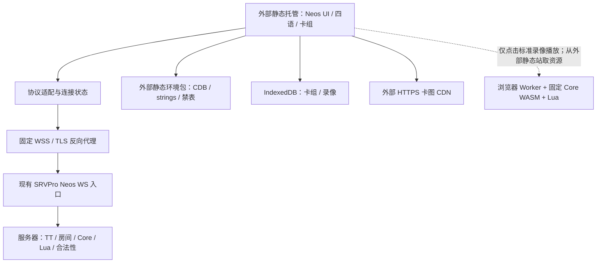

# YGOPro 706 历史环境 Web 客户端设计

> 修订：2026-10-08；服务端／上游核查：2026-09-28；1103 四语裁剪库复制与核查：2026-09-29。
> 状态：第一期已可使用，Cloudflare 自动部署已成功。2026-10-08 获授权后完成第二期录像首版的本地实现与自动化回归，真机与生产样本仍待验收。详细方案与 `special.lua` 处理见 [第二期计划](docs/replay-phase2-plan.md)，使用及证据见 [录像说明](docs/replay-usage.md)。本轮仅修改本项目，官网 HTML 等待单独指令。今年继续使用现有大陆服务器与隧道，明年更换服务器后再处理直连。
> 产品目标：外部托管的静态网页点开即玩，支持手机与桌面；联机页由玩家自行填写昵称和房间名，只固定服务器地址与端口，在线裁定完全由服务端承担。

本轮用户已指定 `locales/1103_*` 的四语裁剪库为项目资源，并明确网页不部署到天梯服务器。当前依据见[1103 资源审计](docs/1103-resource-audit.json)、[暂存说明](resources-staging/1103/README.md)、[服务端审计](docs/server-contract-audit.md)、[上游审计](docs/upstream-audit.md)；[旧资源审计](docs/resource-audit.json)保留为 card-catalog 完整库与禁表的历史记录。

用户已确认在线首版设计并宣布过开工，现确认第一期可用。第二期覆盖下文 P4–P5，2026-10-08 已获条件性开工授权：本轮自动部署完成并验收无问题后进入实施，无需再次询问。本地源码、默认配置、生产实际行为分别记录，不能互相替代。

2026-10-08 单独获授权并实现网页版卡组接收入口，支持公开内容参数与指定来源消息交接，统一解析 YDK／原生 deckbuffer／三分区结构并打开本地编辑器，见 [卡组接收契约](docs/deck-import.md)。官网 HTML／按钮留待下一步；此项不表示第二期录像已开工。

## 0. 本次审查结论与开工门槛

总体方向可行：以 Neos 为基础做专用客户端，复用现有服务器的 Neos WebSocket 接口，不在浏览器在线运行决斗 Core。主要缺口如下。

| 原设计假设／遗漏 | 已核查事实 | 修订决定 |
| --- | --- | --- |
| 旧 card-catalog 完整库可直接作历史卡池 | 用户已明确改用此前裁剪好的四语 1103 库；中／日／韩 5,267 条，英文 5,240 条 | 已原样暂存；以中文裁剪库统一 ID/datas，英文 27 条异画沿 alias 补文本，不重新从完整现代库裁池 |
| 2011.03 足以描述环境 | 服务器介绍明确：OCG 卡池截止 2011-08-31，禁表为 2011.03 | 分开记录卡池截止日期、禁表日期、历史裁定版本 |
| 只填昵称即可进天梯 | TT 默认要求 昵称$密码；TT 是另一个房间字段 | 去 MyCard SSO，保留既有 TT 认证；不另建认证后端 |
| Match Side 可选 | TT 插件用 M# 前缀强制 Match | G1–G3、换备、整场结束必须纳入首版 |
| 固定一个 WSS URL 就完成接入 | 源码有独立 Neos WS，默认关闭；隔离实例开局已验证；2026-10-06 拟用入口服务器本机握手通过，公网域名受腾讯云未备案拦截；用户确认大陆服务器、境外域名且当前无法备案 | 按[WSS 联调说明](docs/wss-integration.md)评估隧道／境外部署，不把办理备案作为当前唯一前置步骤；验收正常公网握手、真实 IP、延迟／资源占用与完整比赛后再确定入口 |
| MR2 已成立 | 通用默认 duel_rule=5，TT 不覆盖；原文目标为 MR2 | 实测HostInfo；TT与约定规则不符时拦Ready，普通房按实际受支持模式运行，不强制TT参数 |
| 有触摸拖拽即可支持手机 | 上游编辑器仍依赖中／右键；整体缩放；对局页隐藏 Header | 增加触控等价操作、手机布局、对局语言入口和真机验收 |
| 切语言先 dispose 旧库 | 下载失败会失去当前显示数据 | 新资源就绪后原子切换，失败保留原状态 |
| 标准 YRP 是通用格式，包到前端即可播 | 本地 core 为 YRP2 + UNIFORM + 多 seed + LZMA；现 Neos 是 yrp3d | 保存原始文件与标准播放分阶段；锁定实际生产格式与 core |
| STOC_REPLAY 只在一次对局末到来 | 宿主可延迟到整场结束连续发送多局录像 | 每局独立入库、去重，等待最后消息，不在第一份到来时关闭连接 |
| 联机页预设为独立 TT 入口 | 用户要求与原版联机页一致，自填昵称、房间名，仅固定 IP／端口 | 统一“加入游戏”；房间名 TT 进入天梯，其他名称按服务器原有语义处理 |
| 默认昵称／托管位置没有写成硬约束 | 用户要求玩家自行输入昵称，且天梯服务器资源不足 | 可编辑昵称是首版能力；前端构建及所有静态资源一律放在天梯服务器之外 |

### 已锁定的审查基线

- Neos：`DarkNeos/neos-ts@a84c443674f82d6d47969915e6cb8656660be364`。按该 SHA 核查的源码事实不代表未来 main。
- neos-protobuf gitlink：`81291cac39ba7c726ef817166c41e028bd0a4e8b`。它参与内部消息对象生成，不代表 WebSocket 上传输 protobuf。
- 本地服务器 HEAD：`f253da853bf15c2742b1effafe222bbb54fc3813`，工作区有既存未提交修改。本次不修改服务端，也不把 HEAD 当作完整部署快照。
- 当前四语裁剪库的源／副本 SHA、大小、差异、搜索尾缀记录在 `docs/1103-resource-audit.json`；旧完整库与禁表结果保留在 `docs/resource-audit.json`，两组输入不混用。
- 本次未读取私密部署配置，未连接生产服务器；未声明生产已启用 MR2、WSS、历史卡池校验或重连。
- 隔离的本地 SRVPro 实例已验证普通 Single 与 TT Match 双人入房、卡组准备和开局；完整比赛及生产兼容性仍属单独验收。

## 1. 范围与产品流程

### 1.1 首版必须完成

- 联机页采用原版 YGOPro 的单一表单：玩家填写昵称和房间名，点击“加入游戏”；仅 IP／端口固定，不展示可编辑地址或服务器选择。
- 房间名输入 `TT` 时进入天梯等待匹配；输入其他名称时按服务器原有规则进入对应房间。客户端不把普通房名改写成 TT，不要求先选择“天梯／普通房”模式。
- 玩家可自行输入、修改昵称，已保存的昵称只是可编辑默认值；不硬编码玩家身份、不用随机 Guest 名替代输入。
- 手机／桌面均能选择卡组、完成整场 TT Match，包括换备。
- 简中、英语、日语、韩语四语 UI、卡名／效果、system strings；同页切换，不断线、不改变卡号。
- 本地卡组编辑、文件／粘贴导入、导出与 IndexedDB 保存。
- 与服务器一致的历史可组卡集合和 2011.3.1 禁限提示；服务端最终验证。
- 前端及全部静态资源在天梯服务器之外以 HTTPS 托管；WSS 接入、明确的失败状态、可诊断的版本信息。
- 针对今年无法备案且不能确认可调整 DNS 的现有服务器，按[上线测试手册](docs/current-server-online-test.md)使用临时 Quick Tunnel 验证。站方 `duel-config.js` 可覆盖构建入口，玩家不编辑连接地址；空配置禁用在线入场，临时地址变化后更新静态部署。固定长期入口及明年迁移单独验收。
- 在线不下载或执行 Replay Core、卡片 Lua。SQLite 的 `sql-wasm.wasm` 可按需要加载，它不是决斗 Core。

主流程：

```text
打开静态站点
→ 自动恢复语言／本地卡组；首次用户可选随包示例卡组
→ 打开统一联机页，自行填写昵称（天梯身份沿用 昵称$密码）
→ 自行输入房间名：TT 为天梯匹配，其他名称为普通房间／宿主原有房间命令
→ 检查资源就绪，连接固定 WSS
→ 发送 PLAYER_INFO 与 JOIN_GAME(pass=玩家输入的房间名)
→ 由服务器处理入房；上传卡组、准备、按实际房间模式对局（TT 包括 G1／换备／G2，必要时 G3）
→ 整场结果；录像保存能力按阶段开放
```

示例卡组来自已有服务器示例资源的经核验静态快照，校验卡池与禁限，记录来源；不能让首次访问用户必须先安装桌面客户端才能取到 YDK。允许用户直接导入自己的卡组。

### 1.2 分期与非目标

标准 YRP 库与播放分别在 P4／P5，不阻塞首版在线客户端。未实现的功能不显示可点击的“播放”按钮，也不把 `features.replay=true` 当默认值。

首版不做新的账号数据库、MyCard SSO／匹配／观战、MDPro 云卡组、多环境切换、AI、本地在线裁定、完整天梯统计站移植。保留到既有介绍／统计页面的链接即可；需要嵌入 API 时另核对 HTTPS、CORS 和权限。

“轻量”指少启动请求、按需资源和低维护成本，不以删掉 TT 认证、换备、网络恢复或手机操作为代价。PWA、离线缓存、网页内的公开房间列表、跨设备云同步后续评估。已增加从外部房间列表链接进入观战的参数契约：`room`、`spectate=1`、可选公开 `nickname`；默认 `observer from web`；2026-10-09 按用户要求，一键观战入房或取消时清空普通联机昵称／房名缓存。具体房间和观战权限由宿主处理，列表 HTML 的改动另行实施，见 [房间链接观战](docs/room-spectator-links.md)。

## 2. 架构与上游边界



默认不新增 WebSocket↔TCP 服务：现有宿主已支持 Neos WS。只有验证不能使用该入口时，才评估固定目标、受限的字节桥；不得建任意 TCP 代理。

天梯服务器只保留既有认证、匹配、房间、对局 Core/Lua 和必要的 WS/WSS 接入，不为这个项目托管 HTML、JS、CSS、CDB、strings、禁表、字体或 Replay 资源，也不执行前端构建。静态文件从外部托管／CDN直接到浏览器，不经天梯服务器中转。外部静态托管不替代对战服务，也不自动解决 WSS 证书与入口问题。

尽量保留上游 UI／service／middleware／adapter／store 分层。专用配置集中 `src/variant/`，新增适配集中小模块。去掉 SSO 初始化、在线卡组请求及不可达路由的静态依赖；仅藏按钮而继续发请求不算瘦身完成。

上游在线传输是原生 YGOPro 包，内部 protobuf 模型继续复用。原 `src/api/ocgcore/` 路径名不表示浏览器正在跑 Core，不应据此整目录删除。

建议新增：

```text
src/variant/          固定环境、资源URL、公开部署参数
src/session/          统一联机、房间命令、重连、敏感会话内存
src/i18n/             四语UI与切换事务
src/resources/        manifest、数据库、strings、禁表
src/replay/           独立库；标准播放使用动态import
scripts/              构建资源、审计、发布校验
environment/          来源锁文件、历史ID集合、文本override
docs/                 审计、兼容矩阵、实测记录
```

这些是目标目录，不代表已存在的实现。

## 3. 连接、协议和房间契约

### 3.1 固定入口与传输

服务器源码在 HTTP 模块启用路径中建立独立 Neos WS。默认 `neos.enabled=false`、端口 7977；游戏 TCP 7911 与网页 HTTP 7922 都不能直接当 WSS。端口仅为源码默认／现有文档值，部署以实际入口为准。

生产配置必须显式填写完整 `wss://域名/路径`；未配置则显示配置错误，不能回退 MyCard 或猜测 IP。本机隔离联调也用临时证书和 `wss://`；当前客户端不接受 `ws://`。不要把协议凭据放在 URL、查询串或静态配置中。

固定 Neos 版本的配置为 4962，即 `0x1362`；本地 core 的 `PRO_VERSION` 也是 `0x1362`。服务器默认 JSON 仍写 4945，启动代码会尝试从 core 源码覆盖；本机隔离日志已确认运行值为 `0x1362`。因此：
1. P0 记录实际启动版本及握手结果；
2. 版本不匹配要显示可理解的错误；
3. 不以扩大服务端 `alternative_versions` 掩盖未验证的兼容问题。

服务端 `hostinfo.lflist` 使用加载顺序中的列表索引，网页 HostInfo 显示的是 Core 返回的协议 hash。隔离测试把 2011.3.1 禁表放在索引 0，得到 `0x73ec4051`；生产禁表顺序必须另行核对。猜拳协议编号以 Core 为准：`1=剪刀、2=石头、3=布`，客户端发送和显示适配器已按此修正。

### 3.2 包格式与适配器

WS／TCP 均使用：

```text
uint16LE length（opcode + payload 的字节数）
uint8 opcode
payload
```

WS 不额外封装 JSON、base64 或 protobuf。保留发送 `PLAYER_INFO → JOIN_GAME → UPDATE_DECK → Ready` 的服务器期望顺序。

上游解析器能循环拆同一消息中的多包，但使用有符号读取，未完善半包和长度校验。P0 必须验证／修复以下边界，尤其为后续大录像包：
- 使用无符号读取；长度不得小于 opcode 长度，未完整收齐不得读取。
- 支持一条 WS 消息中的多个协议包；如果接入路径可能转发半包，使用累计缓冲重组。
- 验证协议上限、分配上限、截断、未知 opcode 与畸形包；错误只结束本次会话。
- 统一处理 ArrayBuffer／Blob，保证异步读取保序；不丢失错误、关闭通知或最后录像。
- 每次连接独立 epoch／取消令牌；旧连接消息不得写入新对局 store。队列可观测且有内存上限，不能依赖动画完成来无限积压消息。

### 3.3 HostInfo 与 MR2

历史资源目标为 MR2、2011.3.1；TT 是 Match，普通房间模式由房间名命令及服务器决定，不能因固定服务器而强制所有房间进入 TT／Match。必须读取并展示实际 `STOC_JOIN_GAME` HostInfo 中的 mode、duel_rule、lflist、rule、LP、时间与卡组检查配置。当前上游 join handler 只标记已加入，不能继续忽略这些字段。

MR2 场地、阶段、先攻抽卡和相关选择由服务端消息决定；前端只展示和响应，不补规则模拟。场地布局需检查是否误用固定现代区域。TT 的规则／禁表与约定不符时停止 Ready 并提示；普通房间正常接受宿主下发的受支持模式，不因它不是 Match 就拒绝入房。普通房间禁表等参数与本地提示不同，要明确展示差异，客户端卡组提示不得充当入房权限；仅遇到实际不支持的协议／场地规则时明确说明能力限制，不能偷偷改房名或转入 TT。

P0 至少证实普通房与 TT 的区别、TT Match 整场流程、禁表 hash、服务端非法卡组拒绝。2011.03 禁表不自动排除之后发行的新卡，必须单独验证超时代卡被拒绝。

## 4. 原版联机表单、TT 认证与隐私

联机页保留玩家可编辑的“昵称”和“房间名”两个输入，以及统一的“加入游戏”按钮；原版可能把后一字段称为“房间密码”，它对应的协议字段仍是 `JOIN_GAME.pass`。网页可在房间名下提示“输入 TT 进入天梯，其他名称按服务器原有方式进入房间”。只固定服务器端点，不新增必须选择的天梯模式、只读房名或仅允许 TT 的校验。

房间提示中的“原版 YGOPro 联机规则”以新标签页打开 [房间规则说明](https://ygo233.com/usage)，并补充 `M#[房间名]` 进入 BO3（三局两胜）模式；四种显示语言提供对应链接文字和提示，不改变房名传输或观战表单规则。

随后提示非天梯匹配模式下将房间号发给朋友以邀请对方对战。昵称和房名标题旁提供四语复制按钮，仅复制当前输入中 `$` 前的公开部分，保留房名的 `M#` 等前缀及空格；不更改输入、缓存或连接状态。公开部分为空时禁用复制；剪贴板写入成功／失败均反馈，失败时提示手动复制公开部分，不发送或显示密码。

昵称框兼容原版 `昵称$密码` 登录串。原服务器从 `PLAYER_INFO.name` 解析账号凭据，TT 身份认证与房间名是独立概念；`JOIN_GAME.pass` 永远取本次玩家输入的房间名，不取账号密码，也不因填写了账号密码就自动变成 TT。由服务器识别房间命令及是否需要认证，不新建专用 TT 登录页或要求额外选模式。

首次空昵称时在入场前提示填写；恢复的昵称保持可编辑，不锁定为配置值或自动生成值。浏览首页、组卡、导入／导出不要求填写昵称。昵称含凭据时提供遮罩／显示方式，默认不明文回显已有密码部分。

首次直接打开联机页、且没有保存房名时默认预填 `TT`，不自动连接或准备。玩家自行修改／清空的房名继续缓存；链接指定房名优先，一键观战结束仍清空输入。首页以四语显示开源、非盈利及版权声明，说明相关素材权利归属，并可应权利人要求调整或下架。

房间名作为玩家输入原样发送，保留服务端支持的大小写、空格、房间密码及命令语法；不擅自 trim、改大小写、拆分／拼接密码或将房间名解析为 IP／端口。只校验协议字段长度和 NUL 等不能安全编码的字符。普通命名房按宿主的同名加入／不存在创建处理，保留 `房名$房间密码` 等既有语法；特殊命令和空房名按服务器开关处理，空值绝不能自动补成 TT。昵称中的 `$` 凭据语法不套用到房间字段。

服务端会对房间命令去除前后空格并作大小写归一，因此 `tt` 等输入也可能被识别为天梯；不能把所有非字面 `TT` 都宣称为普通房。UI可以按相同规则提示用途，但实际传输保留输入，由服务器解析，不新增自己的房间命令系统。

昵称和房间名支持中／英／日／韩文字及服务端允许的普通字符，不根据网页语言限制字符集。修改输入在下一次入场生效；已连接／重连会话始终保留本次实际发送的身份及房间信息，不能因改输入框立即换房、变更身份或破坏认证。切换身份／房间通过明确退出后重新入场完成。手机输入法组合输入期间不提前提交。

首版保留原服务端“新昵称第一次加入 TT 时注册”的行为并说明，不额外发 HTTP 注册请求。普通联机是否允许纯昵称，按服务器实际规则处理。昵称大小写和空格不在前端擅自规范化；按服务端协议校验空值、长度与歧义字符并反馈。

- 按协议 UTF-16 code unit 分别限制完整昵称登录串与房间字段；不得静默截断昵称、密码或房间名。长度、NUL、换行、额外分隔符和反斜杠按各字段的实际宿主解析行为校验，错误提示修改，不能自动改密码。
- 服务端会按 `$` 拆密码、处理反斜杠；不要给用户提供前端接受而服务器另作解释的输入。
- 按 2026-10-09 用户要求，普通联机持久缓存不含凭据的昵称部分、房名部分及显示语言，退出／返回／刷新仍预填。完整 `昵称$密码` 和 `房名$房间密码` 仅保留当前标签页内存，正常返回继续显示，刷新后重新输入密码。当前选中或成功保存的卡组作为后续编辑与入房默认卡组；已删除的选择回退到现有第一套。由链接一键观战入场或取消时清空昵称／房名草稿及缓存，返回普通联机页为空。实现与验证见 [会话说明](docs/session-recovery.md)。
- 账号／房间密码与完整登录串不得进入公开昵称显示、聊天、URL、日志、遥测、卡组名、录像名、错误导出或测试快照。
- TT 默认赛前隐藏名字，客户端尊重服务器下发身份，不从公开页面/API反查匿名对手。
- 浏览器可使用密码管理器；不承诺静态网页能提供账户找回或修改密码服务。

## 5. 历史卡池与四语资源构建

### 5.1 用户确认的 1103 输入与暂存结果

用户已确认以下四份库是此前裁剪好的 1103 环境卡池。来源根目录为：
`F:/MyCardLibrary/koishipro/KoishiPro-master-win32-zh-CN/locales`。

本轮仅复制 CDB，原文件及暂存副本均不清洗、不 VACUUM、不统一字段；源／副本 SHA256 一致。暂存位置不作为未来的构建或公网 URL 契约，正式位置在开工后确定。

| 来源相对路径 | 本项目暂存副本 | datas／texts 行数 | 大小（字节） |
| --- | --- | --- | --- |
| `1103_zh-CN/cards.cdb` | `resources-staging/1103/zh-CN/cards.cdb` | 5,267／5,267 | 1,695,744 |
| `1103_en-US/cards.cdb` | `resources-staging/1103/en-US/cards.cdb` | 5,240／5,240 | 1,900,544 |
| `1103_ja-JP/cards.cdb` | `resources-staging/1103/ja-JP/cards.cdb` | 5,267／5,267 | 2,414,592 |
| `1103_ko-KR/cards.cdb` | `resources-staging/1103/ko-KR/cards.cdb` | 5,267／5,267 | 2,149,376 |

四库 SQLite 检查均通过，datas/texts 对齐，无缺失 alias 目标；各含 78 个 Token、33 张超量卡，无灵摆或 Link 类型。中／日／韩 ID 集合相同，英文缺 27 个异画 ID，没有额外 ID。这 27 项的 alias 均在裁剪英文库中存在文本，且其中文记录与对应原卡的类型、攻防、等级、种族、属性、setcode 相同，可按明确映射补齐文本而保留异画 ID。

原始 datas 仍有不同：中英 73 行（67 项 ot、6 项 setcode），中日／中韩各 1,390 行（1,387 项 ot、2 项 setcode、1 项 category）。category 差异是同一 uint32 位模式的正负表示；具体卡号和数值见当前审计。不能因语言切换采用不同 datas。

已观察到的文本问题：
- 中文全部 5,267 条 desc 末尾带独立行 `★706环境`；英文全部 5,240 条末尾带 `★706 nexus environment`。
- 日文、韩文 texts 中未找到独立数字标记 706／1103；没有同类尾缀需要删除。
- 英文 5 张卡的 desc 合计存在 26 个既有 U+FFFD 替换字符，集中在列表符位置；卡号及片段已记录，不能把它们当成本次复制导致的编码问题。

前轮 `card-catalog/databases` 的 14,981／14,968 行完整库不再是本项目默认输入；它的现代类型、13 ID 差异和超安全整数统计仅属于旧审计。当前四份 1103 库没有超出 JS 安全整数的 datas 值，但生成器仍须支持保真整数。`ot & 0x8` 也仍不是发行日期标记，不能据此再裁一次历史池。

### 5.2 已确定的后续处理方案（开工后执行）

采用中文 1103 裁剪库的 **5,267 个 ID 与 datas** 作为客户端四语统一基线；英文、日文、韩文库只提供各自 texts。按此方案处理用户已确认的卡池，不再等待重新从现代完整库划定产品范围。

客户端基线与服务端最终规则是两个职责：上线前仍需核对实际服务端 CDB／expansions／HostInfo 与该基线的兼容性，若有影响类型、alias、setcode 或合法性的冲突，列出具体差异修正，不以某一语言的新字段覆盖所有语言，也不自动替换天梯服务器文件。Replay CardReader 另按实际生产资源版本验证。

```text
原样暂存的四语 1103 CDB
  ├─ 中文裁剪库：统一 ID / datas
  ├─ 各语 texts：保留历史描述，英文异画沿已核验 alias 补齐
  └─ 明确的搜索尾缀清理 / 文本 override
                  ↓ 只写新产物
四份同 ID、同 datas、不同 texts 的环境 CDB
  + 可组性标记 / 四语 strings / 禁表 / manifest
                  ↓
外部静态托管 / CDN
```

区分 `deckEligibleIds` 与 `displaySupportIds`：中文基线中 78 个 Token 保留显示但禁止入组，其余 5,189 条是非 Token 的卡号记录，包含异画，不能宣传为 5,189 种独立卡。规则同名／辅助引用继续按 core 语义处理。禁止卡可以搜索并标记为禁止；它仍是历史卡池的一部分。

生成器从这份单一基线输出可组性表或集合，不手工再维护另一套历史白名单。协议中遇到未知辅助 ID 时显示卡号并报告资源差异，不从完整库静默扩张可组集合。

构建脚本 `scripts/build-environment-assets.mjs` 的计划职责：

1. 校验暂存输入的 SQLite header、完整性、schema、SHA；源文件只读，拒绝 LFS pointer。审计静态副本可用 immutable 模式，避免生成 WAL/SHM 旁文件。
2. 复制中文 ID/datas 到每份新输出，规范整数位模式并记录输入差异；不从其他语言合并较新的 setcode 或 ot。
3. 优先使用同 ID 的目标语 texts；对英文已核验的 27 个缺失异画 ID，复制对应 alias 的英文文本到新 ID，不改卡组中的异画 ID。仅当 alias 的文本等价关系已核验时使用这一步，不能把规则同名卡一概当异画。
4. 其他缺失按目标语同 ID → 经验证的同语异画原卡 → 英文 → 中文 → 卡号回退，并记录每条来源。默认不引入完整现代库作为自动文本来源；后续逐卡补缺必须兼顾历史文本。
5. 按 §5.4 仅清理精确搜索尾缀，再应用经审核的逐卡文本 override；不自动机器翻译或替换历史效果描述。
6. 保留 setcode 等 64 位整数能力，避免未来输入变化经过 Number 舍入；sql.js 查询与 Replay CardReader 同样要验证精度。
7. 只在生成副本 VACUUM，输出确定性的规范行 hash 与字节 SHA256；当前原样暂存文件永不作为清洗目标。
8. 验证输出四库均为 5,267 行且 ID/datas 一致，78 个 Token 不可入组，27 个英文缺失 ID 全部有明确文本来源，辅助引用闭合，清理前后 datas 与卡组 ID 不变。
9. 生成 missing-text／alias-recovery／text-cleanup／override 报告。未完成与真实服务端的兼容验收时，产物标为待联调，不宣称已适配生产。

### 5.3 版本清单与发布

`environment.lock.json` 记录输入来源／commit／SHA、中文 1103 基线选择、历史 ID 集合摘要、英文异画映射、文本清理规则版本、生成器版本、四语 strings 来源、禁表来源。本轮的原件身份先由暂存 README 和审计 JSON 记录，正式 lock 文件在开工后生成；不存在的证据不能填假的 SHA。

发布 manifest 至少包含：
- schemaVersion、environmentId、resourceRevision；
- poolCutoff=`2011-08-31`、banlistId=`2011.3.1`、协议 lflist hash；
- 可组／辅助 ID 集合摘要及行数、canonical datas hash；
- 每种语言 cdb／strings 的相对 URL、字节数、SHA256、文本 fallback 报告；
- 兼容的 client protocol／服务器环境版本；Replay 发布后另关联 core、Lua 和编译参数。

所有资源放在不可变 revision 路径，先上传完整资源再发布应用入口，保留旧 revision 供缓存和旧录像使用。单次会话固定一版 manifest，不在对局中静默升级；坏 hash、错误 MIME、HTML 404 页面和 LFS pointer 均应被识别。

本次四份裁剪库共 8,160,256 字节，单个不到 2.5 MiB；这些已锁定的资源源文件随工程以普通 Git 版本管理，不把上 LFS 作为前置条件。若后续资源频繁更新或体积增长，再迁移到资源仓库 LFS／固定 Release／对象存储，保留源 SHA 与版本历史。无论输入运输方式如何，浏览器只访问外部静态部署后的真实文件，不依赖 GitHub Raw／LFS 运行时下载；CI 必须校验实体文件与 SHA。[GitHub LFS 说明](https://docs.github.com/en/repositories/working-with-files/managing-large-files/about-git-large-file-storage)。

### 5.4 搜索尾缀与文本清理

决定在未来**发布产物**中移除中／英的上述统一搜索尾缀；本轮复制品逐字节保留。因为网页只服务一个环境，环境名称在页面中集中展示，不需要每张卡效果末尾重复贴标签。若将来需要按环境检索，使用独立 metadata，而不是污染效果文本。

- 只匹配 desc 末尾的独立行 `★706环境`（zh-CN）或 `★706 nexus environment`（en-US），兼容该输入的 CRLF/LF，移除该行及与正文之间的尾部分隔空行。
- 不执行全库“删除 706／1103”正则，不修改卡名、正文数字、卡号、str1..str16、历史裁定备注或 Lua；未知标记保留并列报告。
- 当前期望清理数为中文 5,267、英文 5,240 个源文本；英文 27 条异画补齐后发布库对应 5,267 条干净描述。记录源字段与生成字段的前后 hash，验证清理幂等且正文未变。
- 英文卡号 `17032740/33900648/52675689/63485233/73853830` 的列表符乱码另走逐卡 desc override；核验每处仅为损坏列表符后统一为可读项目符号，保留其后的效果正文，不做全库 U+FFFD 替换。
- 日／韩没有同类标记，不进行推测性删除。既有历史文本优先保留；尾缀清理不等于采用现代勘误文本。

## 6. 禁限卡与卡组编辑

### 6.1 禁表已核查结果

指定文件：
`F:/MyCardLibrary/koishipro/KoishiPro-master-win32-zh-CN/expansions/lflist.conf`。

- 精确表头 `!2011.3.1`，一张表，134 条：禁止 50、限制 66、准限 18。
- 无重复 ID、无 whitelist 指令，所有条目都能在中文源库找到。
- 与本地 `srvprotianti/ygopro/lflist.conf` 的同名段逐条一致。
- 文件 SHA256：`ea375c0874c8674aac515e6020aa7db85b372608eebeb15e6896fc108143a1cc`。
- 按本地 core 算法计算的协议 hash：`0x73ec4051`。它不是 SHA256；必须与实际房间 HostInfo 比对。

用户后续提供的正式服务器 `lflist.conf` 与上述本地文件不同：2011.3 段含错拼 ID `26202465`，并将光之护封剑 `72302403` 写成 `72304203`，对应实测 hash `0x4250bce9`。本机修正版已恢复全部 134 条基线及 `0x73ec4051`、保持其余 102 张表字节不变；正式替换与新房间复验仍待执行。差异及部署步骤见 [正式禁表修正](docs/banlist-diagnosis.md)，客户端继续采用本节基线。

构建从指定表名提取，不能默认选择多表文件第一段。输出表名、条目、未列出卡默认值 3、协议 hash 和源 SHA。如未来出现 whitelist 等扩展，明确实现该语义或拒绝构建，不猜测解析。

### 6.2 编辑与校验

- 搜索／筛选／添加只允许历史可组集合；Token 只显示、不入组。查询支持当前语文本及卡号，参数化 SQL。
- 禁限计数跨 Main + Extra + Side 汇总，参照本地 core 的 `get_duel_code()`、alias／rule_code 语义；不能按三块各自独立计数，也不能无条件把所有 alias 视为异画。
- 主／额外／副卡组数量与卡片类型提示按锁定规则；准备时由服务器再次校验。不要放宽服务端检查迁就前端。
- YDK 导入保留原始 ID、重复数量与区域；未知卡／超时代卡／超限项标红，不静默删除、替换或去重。
- 对含 NUL、非法数值、过大输入、恶意文件名给出错误；解析上限独立于合法卡组数量，允许显示不合法卡组供用户修正。
- 文件导入与手动粘贴文本都是首版能力；Clipboard API 一键读取失败时可直接粘贴。拖放只是增强。
- 导出 YDK 不包含语言、密码或内部状态；手机支持浏览器文件下载，分享能力按平台提供。
- 自动保存有可见成功／失败状态。IndexedDB 不可用、配额满、隐私模式时允许临时编辑和导出，不能把未落盘显示成已保存。
- 卡组 storage key 使用本项目 namespace 与 schemaVersion；迁移只迁本项目数据，不覆盖原 Neos 的同源 decks。
- 多标签页编辑用 revision／冲突提示，不能无提示互相覆盖。换备基准牌组必须按标签页隔离，进入房间时记录本标签页实际提交的牌组，退出房间时清除；不能共用 localStorage 的单一键。默认禁止同一页面建立两场对局。
- 提供导出备份与单独清理资源缓存；清缓存不连带删除玩家卡组和录像。浏览器存储可能被回收，不等同于永久云保存。[存储说明](https://developer.mozilla.org/en-US/docs/Web/API/Storage_API/Storage_quotas_and_eviction_criteria)。

## 7. 四语言与运行中切换

支持 `zh-CN/en-US/ja-JP/ko-KR`；解析顺序为有效 URL `lang` 参数 → 有效已存选择 → navigator.languages → en-US。URL 支持 `zh/en/ja/ko`，兼容 `cn` 及四个完整 locale，有效 hash 参数优先于网页查询参数；资源和路由初始化前捕获。映射常见 zh/en/ja/ko 浏览器子标签，忽略不支持的值。UI 使用现有 i18next／react-i18next；包括错误、等待、换备、确认、无图与资源失败文案。四语 UI 词库与组件库内置文案随选择切换；官网跳转带当前语言。契约与验收见 [语言入口](docs/language-links.md)。

三个显示资源作为一次切换事务：UI messages、system strings、卡片 texts。保留一份 active DB，切换时允许暂存一份候选 DB：
1. 记住请求序号／目标 locale，取消过期请求；
2. 获取当前 revision 下目标语言资源，校验、打开候选 DB，准备 strings；
3. 成功后一次替换 locale／DB／strings，保存选择；
4. 活跃查询完成后释放旧 DB；
5. 失败仍用原语言／旧库，允许重试，不断开 WebSocket。

切换期间决斗状态、选择结果、计时、协议处理继续；不重建 socket，不调用全局 duel reset。缓存保存 ID／结构化描述参数，避免提前永久存成旧语言字符串。英语回退文案要可见地保持内容完整。

当前上游 Header 在 waitroom／duel／side 隐藏，语言入口必须在这些页面另有可触达位置。切换菜单不能覆盖必需操作按钮。

准备页当前实现将语言选择放在页顶；退出／聊天按钮直接显示完整文字。入房与选择卡组默认不上传卡组、不准备；玩家点击「准备决斗」后才发送 `UPDATE_DECK`／`HS_READY`。这是服务端 Core 在服务器模式中上传卡组即自动准备的必要适配，不能只将页面显示伪装成未准备。

服务端聊天／错误提示不是前端 strings。复用已有 `/zh /en /ja /ko` 命令，在入场就绪后以及用户明确切换语言后同步一次；是否允许当时发送按真实服务端验证，失败不影响联机。已到达的聊天保留原文，不承诺自动翻译；记录的卡片提示可按 ID 重新渲染。

`strings.conf` 固定版本随环境包部署，按 locale/revision 独立缓存，不继续用未命名空间的 `!system_1000` 全局 localStorage key。缺失字段有确定回退，不保留另一语言的偶然残值。

## 8. 手机端与“点开即玩”验收

现 Neos 有触摸拖拽和整体缩放，但编辑器右键删除／中键换区、桌面基准场地、隐藏 Header 都需要补齐。首版不能仅通过桌面浏览器缩小窗口验收。

### 8.1 交互与布局

2026-10-07 手机界面实现采用：组卡页按「管理／编辑／搜索」切换，同页保留编辑草稿；仅场地缩放，HUD／工具栏／弹窗保持物理尺寸；详情和历史在竖屏为底部面板、横屏为侧栏，提供触摸关闭。设置统一为带「关闭」与叉号的模态窗，并从决斗工具栏进入。旋转及切换语言不清空未保存组卡内容。具体复测步骤见 [手机界面调整](docs/mobile-ui.md)，浏览器触控模拟不代替真机验收。

2026-10-10 换备页沿用紧凑卡图与至少 44 px 的直接换区按钮，避免边缘浮动菜单闪烁；按钮显示目标区域，卡图用于查看详情。顶部固定重置／确认和区域数量，下方原生滚动区按实际视口限高；底部预留安全区与操作余量，横竖屏均可浏览最后一张备牌。旋转保留换备草稿，重置恢复本次换备初始卡组；仍按原协议提交原卡号、分区、顺序及重复张数。验证命令与真机边界见 [手机界面调整](docs/mobile-ui.md)。

手机等待页优先显示玩家席位与卡组选择，详细规则折叠，底部固定手动准备／开始。决斗详情／区域卡列表使用无阻挡遮罩的紧凑面板，避开底部工具栏；竖屏约 34% 视口高度、横屏窄侧栏，卡图缩小。手机选择操作与查看效果分开：点卡图选择，独立按钮预览；关闭预览、旋转不会清空选择，确认／取消／完成收起预览。保持服务器原始选择索引及响应协议。

- 添加 viewport meta；按动态视口高度和 safe-area 布局。浏览器工具栏展开、输入法弹出、刘海与手势区不遮挡确认／取消。
- 竖屏可完成首页、卡组和房间操作；对局建议横屏，竖屏仍可查看并操作待决选择。提示旋转即可，不强制依赖锁横屏或全屏 API。
- 卡片点击可查看详情／打开操作菜单；添加、删除、Main／Extra／Side 移动提供显式按钮。不以 hover、右键、中键、双击或长按作为唯一入口。
- 卡片多选、排序、选数量、选位置、连锁、宣言／计数器等弹窗可滚动，确认／取消固定可见；拖动不能触发浏览器返回或误选。
- 主要触控目标至少约 44 CSS px；文字详情可读可滚动，颜色之外有禁限／选中标识。支持键盘焦点、Esc／返回关闭弹窗。
- 不通过整体缩小到 0.3 来达成“能显示完整场地”；必要时折叠聊天／日志、侧栏变抽屉、允许场地局部查看。
- 卡图失败有占位、卡号／卡名与详情文本；禁止卡图加载失败阻塞游戏响应。不同语言首版共用图源即可。
- 音频由用户手势启用，提供静音；不能因自动播放被拒绝卡住消息链。
- 原生文件选择和文本粘贴可用；不依赖桌面目录访问、拖文件或剪贴板权限。Clipboard 读取需要安全上下文和用户许可。[MDN](https://developer.mozilla.org/en-US/docs/Web/API/Clipboard/readText)。

### 8.2 性能目标

P0 测量上游基线后记录具体设备、浏览器、网络与 gzip/Brotli 后传输量；以下是首版工程预算，超出须说明优化或调整依据：
- 普通 4G／约 10 Mbps、100 ms RTT 条件下，首次可操作首页目标 3 秒内；当前语卡组可用目标 8 秒内。
- 首页不下载 Replay Core／Lua、不请求四份 CDB、不预取全卡池图片。
- 在线首版不发布背景音乐和旧卡组封面；保留可关闭的提示音。当前本地静态包约 12.7 MB（未压缩），不把所有资源体积误记为首屏传输量。
- 首屏 JS+CSS 压缩后目标不超过 1.5 MiB（不含按需 CDB／SQLite），卡组阶段记录单语库与 SQLite 的真实成本。
- 列表分页／虚拟化，缩略图按可见区域加载；详情图按需。活动区域搜索与点击目标响应 100 ms 内，持续长任务单独记录。
- 单次正常对局不积累无上限的消息／日志／图片缓存；语言切换与退出 Replay 后检查内存回落。

至少测 Android Chrome 与 iOS Safari 真机，加桌面 Chrome／Firefox／Safari 或实际支持矩阵。Playwright 的触屏／WebKit 模拟负责回归，不能替代真机文件导出、键盘、切后台、内存和触控检查。

## 9. 连接生命周期、断线与房间模式

用明确状态区分 `idle/connecting/authenticating/waiting/dueling/siding/reconnecting/finished/failed`。连接超时、认证失败、资源失败、版本错误、服务端踢出不能都显示“网络异常”。

统一联机入口不代表所有房间都是天梯。普通房的等待页显示房间状态，Single一局结束，Match按实际模式进入Side；不得因连接同一服务器就强制注册TT账号、显示天梯排队／计分或套用TT匿名逻辑。首版至少完成普通Single、普通Match与TT的模式回归；其他特殊命令的结果按服务器及客户端实际支持能力处理。

双打 Tag 使用四个席位；开局需房主操作、四人到齐且全部准备，不能只检查自己与任一对手。当前已补齐四席等待页与第 3／4 席状态处理；完整 Tag 对局的队友轮换、身份与手牌／卡组切换、计时及观战尚未适配和验收，不能将等待页通过等同于双打实战可用。现阶段边界和回归见 [准备页与双打范围](docs/waitroom-ui.md)。

- 重复点击只建立一次会话；离开房间／取消匹配时明确关闭旧连接并清理订阅。打开 Replay 不得与在线对局共用活跃 store。
- 拦截 SPA 内部离开并提示；pagehide／beforeunload 只作尽力提示，不声称能阻止手机杀进程。
- 手机切后台可能停止动画、挂起页面；不能等 requestAnimationFrame 动画完成才处理关键协议。返回前台检查连接与状态，跳过积压动画，计时以服务端为准。[Page Visibility](https://developer.mozilla.org/en-US/docs/Web/API/Page_Visibility_API)。
- 同页后台恢复实现见 [会话说明](docs/session-recovery.md)：返回前台探测失活连接，按宿主确认恢复；失败给出重试／返回入口。刷新／杀进程后的无感恢复不是首版承诺，iOS 真机测试与本地模拟分开记录。
- 重连沿用宿主契约：精确的 name_vpass、原始房间命令及实际房间信息、G1 初始 UPDATE_DECK 原始 payload。输入框后来修改的房名不能用于本次恢复，更不能自动回退TT。另存本场G1字节，绝不能用换备后的当前卡组替代。
- 网页卡组封包须与原生 UPDATE_DECK 的长度、分区、顺序逐字节兼容，不添加尾部填充；已经开始的旧版对局仍冻结旧封包。换备恢复的 DUEL_START 仅为前缀，须应用 CHANGE_SIDE／选边或宿主阶段结束通知再确认；刷新后的手动重入也能从准备页直接进入换备。实现与更新边界见 [会话说明](docs/session-recovery.md)。
- 默认重连时间为源码默认值 90 秒，实际以部署配置为准。用有上限退避，不无限重试错误密码／已结束比赛，不重发上一条 duel response。
- 服务端要求的握手与卡组确认完成前禁用决斗动作；从服务器恢复消息重建状态，不能把客户端旧场地当服务器确认。
- 多标签页提示已有对局，避免误触服务端同账户踢旧连接；不把密码通过 BroadcastChannel 广播。
- TT G1→Side→G2／G3 的区域数量、卡组总多重集、换备超时、先后攻、整场结果全部测试；界面不能在 G1 MSG_WIN 后提前退出 Match。
- 不主动重放非幂等选择操作；如服务端未提供响应序号，采用单次响应锁并等下一个服务器提示。

## 10. 录像：先保存，再验证播放

第二期完整范围为本地文件导入／下载、对局结束后原始录像自动缓存与标准播放；用户已确认不需要云上传。首版已实现，结构、格式边界、special 初始化、资源指纹、限额及 R0–R4 验收统一见 [第二期录像计划](docs/replay-phase2-plan.md)。以下保持总体约束，实际已测范围见录像说明。

### 10.1 P4：本地库与在线捕获

现 Neos 的 `.yrp3d` 是客户端消息格式，不是标准 `.yrp`。本地 core 源码显示 YRP2／REPLAY_UNIFORM／扩展 seed／LZMA，生产还须用真实样本确认，不能仅按扩展名推断。

STOC_REPLAY=`0x17`。应在通用帧解析后、未知消息被丢弃之前取得 replay payload，去除网络帧头，保留完整 replay 字节，不转字符串或 JSON。上游缺少相应声明／handler 的部分以小补丁增加。

宿主可能缓存 G1／G2／G3，到整场 DUEL_END 时连续下发。每份分别保存，按内容 hash 去重，附 session／gameIndex（可确认才填）；不混为一个文件，不在收到第一份时离开或销毁流。不记录对手未公开卡组或重建隐藏信息。

IndexedDB 项目 namespace 下保存：
- 内容 hash、原始文件名、原始 ArrayBuffer、大小、导入／接收时间；
- source=server/local、原始格式与已知 header；
- 可验证的 environment/resourceRevision/core 来源；
- 可选对局信息；不能从当前环境强行给未知来源录像贴“706兼容”标签。

只有 IndexedDB 写入成功才提示“已保存”；失败提供即时下载。用户导入、列表、导出、删除不加载 Core；P4 对标准格式只保证原文件存取，播放按钮显示尚未支持或禁用。未完成 P5 时可以隐藏整个播放入口。

### 10.2 P5：标准播放兼容性门槛

按实际 magic／flags／版本识别并设文件／解压／步数／运行时间上限；拒绝不支持的变体、截断与异常压缩数据。不要因为 parser 宣称支持 yrp/yrp2 就自动开放所有格式。

优先编译生产所用 core，记录 core commit、Lua版本、编译选项、seed处理、CDB和脚本包摘要。用同一文件与桌面客户端逐步结果比对，不能只验证“能解析头”或“最终出现 MSG_WIN”。

只在用户点击支持格式的“播放”时：
```text
dynamic import runtime
→ Worker加载兼容Core WASM与固定资源
→ replay seed/deck/responses驱动
→ 按固定原生协议拆分GAME_MSG并完整查询场地
→ 独立只读区域界面与播放控制（复用卡片API/卡图，不进入在线响应）
```

Worker 可终止；主线程有超时和取消入口。优先单线程 WASM，避免把 SharedArrayBuffer／跨源隔离作为静态部署前提。消息采用有界批次与确认流控；若先全量模拟，必须限制输出总字节／消息数并实测手机内存，不能无上限积累。

Replay store 与在线会话隔离；进入／退出清理 Worker、计时器、临时 DB、object URL。UI暂停不等于无限堆积后台消息。标准 Replay 无需连接对战服务器。

### 10.3 历史 Lua 资源

首选复制“实际生产 loader 最终可见的脚本包”并记录来源。若生产使用标准 scripts + 301zrg/specials/706，构建时按该优先级合并；两个仓库都固定 commit，不跟踪浮动 master。

仅覆盖同名 c<ID>.lua 不足以保证历史规则。706 有 special.lua；相邻桌面项目对原版 YGOPro 还会把其初始化嵌入 utility.lua 并调用 Auxiliary.PreloadUds()。这说明必须核对 core 的 bootstrap／loader，不能机械复用桌面补丁到 WASM。

包括公共 Lua、动态加载与跨卡引用；不能仅遍历可组 ID 挑脚本。优先完整合并已锁定脚本树，若裁剪需验证依赖闭包。缺文件时报告准确依赖，不从网络偷偷下载最新版补齐。

维护授权的脱敏 fixture：含 706 历史改判、特殊初始化、随机过程、连锁、换备后局、长对局及异常样本；比对逐步摘要、关键提示、最终赢家／回合。每次 core、CDB 或脚本变化均回归。旧录像需要旧资源版本；缺兼容资源时解释不支持，不用当前脚本假装正确播放。

## 11. 静态部署、卡图与更新

### 11.1 路由与资源地址

默认 HashRouter，支持域名根路径和 GitHub Pages 项目子路径。Vite base、资源路径统一经过 `staticUrl()`；manifest 里的资源 URL 相对 manifest 自身解析，不能混入以 / 开头的根目录路径。WASM、Worker、字体和卡背也必须测子目录部署。

**已确定：本项目不部署到天梯服务器。** HTML、JS、CSS、四语 CDB／strings、禁表、字体、卡背／占位图以及未来 Replay WASM／Lua 包，都部署在天梯服务器之外的 HTTPS 静态托管／CDN。前端构建和资源生成在开发机或外部 CI 进行；不占用天梯服务器的构建 CPU、静态存储和下载带宽。

前端与环境包优先同一外部静态 origin，以简化缓存和资源读取；若资源另放对象存储／CDN，显式设置 CORS、正确 MIME 和缓存头，校验子路径及 Worker／WASM 加载。卡图继续使用外部 HTTPS 图源。

生产 WSS 仍连接原天梯对战服务，可由现有服务及必要反代提供；静态平台无需 Node 后端、账号数据库、长连接中转或规则引擎。WSS 所需的服务端接入工作不因外部托管而取消，但不借此把静态资源放回天梯服务器。后续访问天梯 HTTP API 需对应 HTTPS入口与CORS；现有纯 HTTP API不能直接从HTTPS页读取。

首选 Cloudflare Pages 或等价静态托管；最终域名未定不妨碍实现。Cloudflare Pages 当前单文件上限 25 MiB，需逐项检查生成 CDB、WASM、脚本包；超限时分包／独立资源存储，不把大文件硬塞进去。[平台限制](https://developers.cloudflare.com/pages/platform/limits/)。

### 11.2 卡图

上游配置 Moecube HTTPS 非标准端口图源可作为候选，不视为可用性承诺。正式发布前抽样验证历史 ID／异画覆盖、Android/iOS网络可达性和图源使用条件；避免无授权批量镜像。

至少提供本地卡背／占位、超时／错误回退、按需加载、缓存；外部源故障不阻止使用 CDB 查看效果和继续操作。首版无需多语言卡图或自建卡图后端，图源可集中配置，业务组件不散落 URL。运行时固定允许域名，不接收用户提供的任意图片 URL。

### 11.3 更新与缓存

首版可无 Service Worker，使用内容版本 URL 与 HTTP缓存即可。后续加入 PWA 时：
- 不在对局／换备过程中强制激活新版、刷新页面；
- HTML／manifest 使用可更新策略，内容版本资源 immutable；
- 更新事务完整后才切版本；保留当前会话依赖；
- 区分缓存与玩家存档，删除缓存不删卡组；
- 在线游戏仍需服务器，不能标成离线可玩。

## 12. 服务器配套与安全边界

前端不能作为权限边界。服务端继续执行身份、合法卡组、禁限、合法行动、隐藏信息与结算。以下仅涉及必要的对战 WSS 接入，不包括前端构建或静态资产托管；本轮已在临时目录用原服务端源码完成隔离测试，没有修改或部署正式服务端。具体配置和实测范围见[WSS 联调说明](docs/wss-integration.md)。

- 开启并限制 Neos WS 入口；TLS 证书、Upgrade、空闲超时、消息大小、连接速率与每 IP 配额明确配置。
- 校验允许的 Origin；它是浏览器入口约束，不替代 TT认证。普通 CORS配置不能替代 WS握手检查。
- 只信任明确的反代地址，反代覆盖转发IP头；公网不能绕过反代伪造头。
- 已发现配置不一致：默认是 `neos.ip_header`，处理器读 `neos.trusted_proxy_header`。上线前修复／对齐并测试两个不同客户端IP与伪造头，不然限流、同IP策略或本地连接识别可能错误。
- 服务端输出聊天、昵称、卡名与文件名作为文本渲染；若有已有富文本格式采用固定白名单，禁止插入任意 HTML。
- CSP 约束 connect-src/img-src/worker-src 等；为SQLite WASM等列出实际所需能力后测试，不盲目设宽泛通配。生产不加载任意远程脚本。
- 发布源码与资源保留各自来源／许可。Neos 为 GPL-3.0，保留 LICENSE与版权信息、提供对应版本源码入口；卡图、字体、卡库、脚本授权分别核对，不以代码许可替代素材来源。[上游项目](https://github.com/DarkNeos/neos-ts)。
- 日志仅含 client build、environment revision、协议版本、错误码和脱敏状态；默认不收集密码、卡组、聊天、完整网络包。测试抓包与真实录像不能直接入公开仓库。

## 13. 构建与上游同步

用户已确认设计并宣布开工；Neos 源码已检出，本地依赖安装、构建及隔离联调已进行。后续构建机仍为开发机或外部 CI，不使用天梯服务器。

先在独立工作目录按固定 SHA 导入 Neos，再合入本目录的设计与专用文件；不在非空目录直接 clone 覆盖，也不把审计临时目录当正式工程。origin 指未来本项目远端，upstream 指 DarkNeos；未创建远端前不编造仓库地址。

固定 lockfile、Node/npm环境、gitlink和生成代码。当前生成的 `src/api/ocgcore/idl/ocgcore.ts` 已提交；无协议变更时不应为正常构建强制重新运行 protoc。协议变更才锁定 protoc／TS插件并审核生成 diff。

上游 build 曾使用 `cp -r`，e2e有POSIX环境变量赋值／sh。本项目已替换构建中的复制命令，并在 Windows PowerShell 完成 `npm ci` 和 `npm run build`；Linux CI 及上游原版基线仍需另验。

上游测试依赖外部账号／实时服务的部分与本项目离线mock区分记录，不向正式天梯自动造比赛。现有 e2e仅桌面Chrome，补触屏／WebKit；四语key、资源与协议边界做本项目测试。

同步上游流程：
1. fetch 并在独立分支审查差异；
2. 保留固定环境与无SSO边界，不自动升级服务端core或706脚本；
3. 协议修复与本地适配一起验证，不因为上游更新就无条件接受协议改动；
4. 运行本次影响的构建／资源／UI／协议回归；Replay已上线后加入对应fixture；
5. 通过测试服完整Match与移动端smoke后才发布，保留旧应用／资源的回退入口。

## 14. 实施阶段与完成定义

P0–P3 已获施工授权并完成可用首版，用户现确认第一期可使用；具体测试证据与历史待测项见施工清单。`121.4.34.71:7911` 仍为 YGOPro TCP，网页使用已配置的公网隧道 WSS。2026-10-08 用户授权第二期施工，P4–P5 首版已实现并通过原生录像、隔离 WSS 和触屏尺寸回归；格式范围、资源锁与未测真机／生产项见 [录像说明](docs/replay-usage.md)。天梯官网 HTML 仍等单独指令。

| 阶段 | 产物 | 退出条件 |
| --- | --- | --- |
| P0 基线与兼容性验证 | 固定Neos工程、外部构建记录、非敏感环境锁、测试服连接样例、1103资源兼容记录 | 原版构建可重现；TT握手／HostInfo／版本可核验；手机关键选择与一次换备路径可验证；用户指定1103基线与实际服务端的差异及MR2偏差有明确解决项 |
| P1 环境资源与本地功能 | 四库生成器、manifest、禁表、四语、卡组存储／导入／导出、示例卡组 | 输出同池同datas；回退可审计；语言失败原子回滚；离线编辑与文件能力验收 |
| P2 专用在线客户端 | 去SSO／MDPro、固定WSS、自填昵称／房间名的统一联机页、普通房／TT、手机布局、Match／重连 | Web↔桌面完成普通Single／Match及TT；重连保留原房间且换备中断用G1原始payload；无Core/Lua在线依赖 |
| P3 发布验收 | 外部HTTPS静态站点、WSS配套、性能报告、真机矩阵、回退记录 | 静态资产／构建不占天梯服务器；四语／子路径／真实IP／非法卡拒绝／手机完整比赛通过，才称在线首版可发布 |
| P4 录像库 | 原始文件导入导出、IndexedDB、多局STOC_REPLAY捕获 | 原始字节往返一致；延迟多局、存储失败与去重通过 |
| P5 标准播放 | 兼容Worker/WASM、历史脚本pack、fixture回归 | 指定生产格式与桌面一致；资源懒加载；手机限额／取消／版本不兼容处理通过 |

P0风险验证优先于全面美化与四语翻译铺开；P1可在等待WSS时使用已确认的1103输入并行准备，未完成服务端兼容验收的产物标为待联调。P2/P3真实对局结果不能用模拟器或静态构建成功代替。

## 15. 验证清单

| 范围 | 有意义的验证 |
| --- | --- |
| 数据 | 四输出库5,267行且ID/datas一致；78个Token不能入组；英文27个异画文本补齐且ID不变；中英精确尾缀清理幂等；未知数字/备注不删除；5张英文卡列表符override；保真整数与坏输入检查 |
| 禁限 | 134条及0x73ec4051；Main+Extra+Side合计；异画/规则同名卡；服务端独立拒绝非法与超时代卡 |
| 联机与凭据 | 自填昵称/房间名，仅固定IP/端口；原版昵称$密码、房名$密码分属两字段；TT/tt/普通名/空值按宿主处理；两客户端同名房；多语/UTF16/手机输入法；修改仅下次入场生效；日志/URL/持久存储无凭据 |
| 协议 | 版本错误；无符号长度；粘包/半包/畸形包；旧连接回调隔离；房名原样传输；HostInfo按普通Single/Match和TT分别核验，不强制普通房采用TT参数 |
| 对局 | RPS、先后攻、抽卡、召唤/盖放、连锁、选卡/位置/数量/排序/宣言/计数器/总和、战斗、LP、投降；异常提示不中断整个UI |
| 房间模式 | 普通Single一局结束；普通Match及TT的G1–G3/Side/超时/整场结算；断网/换网后原房间恢复，不重发旧选择或转入TT；末尾多局录像 |
| 手机 | 真机旋转、键盘遮挡、无鼠标完成组卡/全部选择/换备；切后台/锁屏/来电；文件导入/导出 |
| 四语 | 所有入口；连续快速切换；离线/404/hash失败保持旧语言；WS和deck ID不变；服务端聊天语言另同步 |
| 本地存储 | reload、配额满、不可用、schema迁移、多标签页冲突、导出备份；清缓存不删用户存档 |
| 静态部署 | 构建及所有静态请求在天梯服务器之外；根路径/子路径/Hash刷新；SQLite/Worker/图片路径；跨静态源CORS/MIME；HTTPS/WSS；旧缓存新版本混合失败可恢复 |
| 性能 | 首页不加载Replay Core/Lua/四库；网络请求无MyCard/MDPro；卡图离线可操作；持续对局无无界队列 |
| Replay（对应阶段） | 原字节存取；YRP变体/坏文件/压缩上限；多局延迟接收；脚本初始化；逐步与桌面比对；取消/内存/懒加载 |

fixture 只使用明确授权的测试数据；真实玩家录像含双方卡组，不默认作为可公开样本。优先从隔离测试服生成。

## 16. 待取得的部署证据

以下不是要重新讨论产品方向；它们决定能否完成生产联调。由维护者提供非敏感摘要或测试环境实测取得，无需公开整份配置。

1. 实际 WSS 域名／路径、TLS终止位置、是否已启用Neos；目前尚未确认。
2. 实际core版本／commit／构建参数、卡库及expansions加载顺序，以及与用户已确认的中文1103 ID/datas基线的兼容性；不再要求重新确认这四份裁剪库是否作为项目输入。
3. 真实TT的HostInfo：MR2、Match、2011.3.1 hash、卡池rule与合法性开关；普通房Single/Match、同名加入/不存在创建、房间密码、空值及特殊命令处理；抽样非法卡拒绝结果。
4. 转发IP头与可信反代范围、实际重连窗口、错误/断线行为。
5. 四语 strings 及历史文本 override 来源；四个 1103 源目录的 strings.conf 已随原始资源复制并按 SHA 审核。输入版本以普通 Git 跟踪，CI 取回与验证仍待配置。
6. 外部静态托管的具体平台／域名／基路径和卡图可达性；“不部署到天梯服务器”已确定，不再作为待选择方案。
7. P4/P5再取得：生产YRP样本、标准scripts及706的精确版本、公共脚本初始化顺序。

已获开工授权；未满足上线门槛时仍可推进本地工程、mock 测试和布局，但不能写成“已完成生产兼容”。

## 17. 参考入口

本地依据：
- [宿主开发约束](../srvprotianti/AGENTS.md)、[TT插件](../srvprotianti/plugins/ladder-core/README.md)。
- [卡片目录边界](../srvprotianti/plugins/card-catalog/README.md)、[卡池移植指南](../srvprotianti/docs/CARD_POOL_PORTING_GUIDE.md)。
- [实际介绍页](../srvprotianti/plugins/ladder-web/web/intro.html)、[桌面脚本初始化参考](../srvprotianti-desktop/src-tauri/src/scripts.rs)。
- [服务端精确源码索引](docs/server-contract-audit.md)、[当前1103资源测量](docs/1103-resource-audit.json)、[原件暂存说明](resources-staging/1103/README.md)、[前轮完整库与禁表测量](docs/resource-audit.json)。

固定上游依据：
- [Neos package.json](https://github.com/DarkNeos/neos-ts/blob/a84c443674f82d6d47969915e6cb8656660be364/package.json)。
- [网络流](https://github.com/DarkNeos/neos-ts/blob/a84c443674f82d6d47969915e6cb8656660be364/src/infra/stream.ts)、[包适配器](https://github.com/DarkNeos/neos-ts/blob/a84c443674f82d6d47969915e6cb8656660be364/src/api/ocgcore/ocgAdapter/packet.ts)。
- [SQLite](https://github.com/DarkNeos/neos-ts/blob/a84c443674f82d6d47969915e6cb8656660be364/src/middleware/sqlite/index.ts)、[现有Replay](https://github.com/DarkNeos/neos-ts/blob/a84c443674f82d6d47969915e6cb8656660be364/src/api/ocgcore/replay.ts)。
- [706脚本源](https://github.com/301zrg/specials/tree/master/706)、[标准脚本源](https://github.com/Fluorohydride/ygopro-scripts)；这里是定位入口，实际发布必须在lock文件固定commit。
