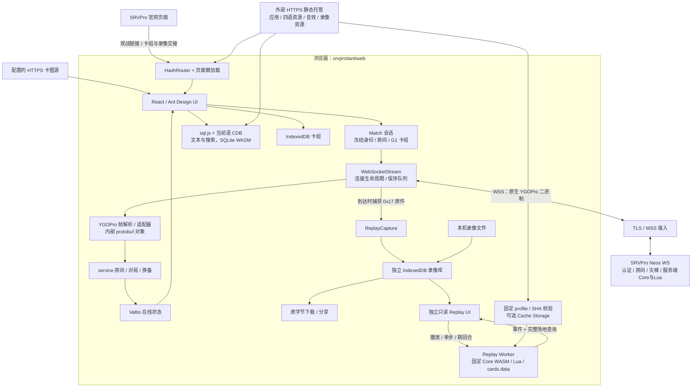
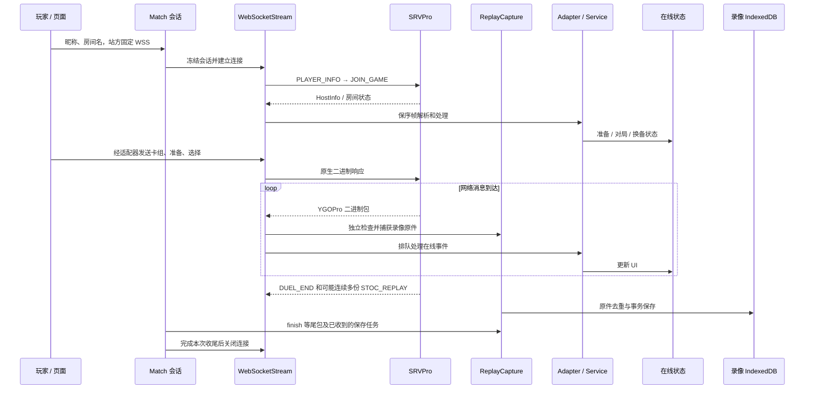
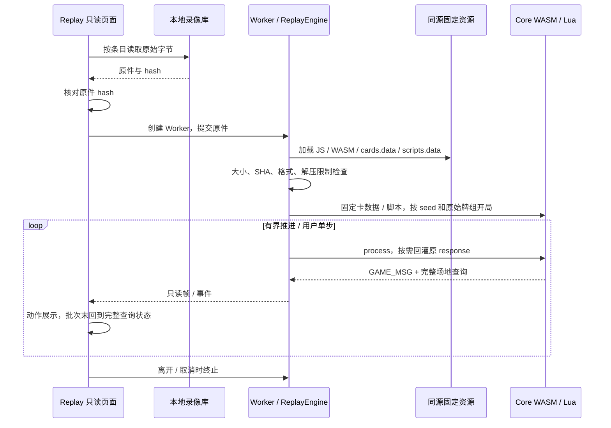
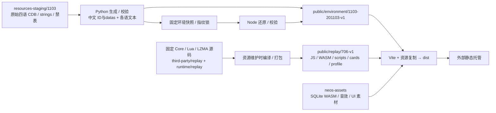

# 当前架构与数据流

更新：2026-10-10。按 HEAD `6e0085d8c58a6054921a475693c36b6b2d751011` 的实装核对。
本文描述源码边界，不断言正式站点今天的部署版本。功能和测试状态见 [PROJECT_STATUS](PROJECT_STATUS.md)，
设计理由见 [设计文档](../YGOPro_706_Web_Client_Design.md)。

## 组件与数据归属

线上规则、账号、房间、计分、数据库与服务器录像目录属于 SRVPro。
网页是外部托管的静态应用，不增加账号或结算后端。SQLite WASM 读取卡片资料；
Replay Core WASM 仅在用户播放时运行，二者不能按“WASM”合并判断。
官网交接与对战 WSS 是两条独立路径，导入卡组／录像不会自动入房。

| 模块责任 | 实际入口 | 维护边界 |
| --- | --- | --- |
| 应用与路由 | [main.tsx](../src/main.tsx)、[NeosRouter](../src/ui/NeosRouter.tsx) | HashRouter、页面懒加载、当前可达入口；源树残留上游文件不等于启用功能 |
| 联机会话 | [Match/util.ts](../src/ui/Match/util.ts)、[socket.ts](../src/middleware/socket.ts)、[stream.ts](../src/infra/stream.ts) | 冻结输入／原卡组、建立连接、恢复与退出 |
| 表单与恢复判断 | [joinForm.ts](../src/variant/joinForm.ts)、[connectionResume.ts](../src/variant/connectionResume.ts) | 完整输入缓存、主动清空、服务端恢复通知、阶段确认 |
| 协议转换与执行 | [packet.ts](../src/api/ocgcore/ocgAdapter/packet.ts)、[executor.ts](../src/service/executor.ts)、[onSocketMessage.ts](../src/service/onSocketMessage.ts) | 帧边界、内部对象、保序处理；不能直接作为只读 Replay handler 复用 |
| 在线状态与显示 | [stores](../src/stores/)、[container](../src/container/)、[duel service](../src/service/duel/)、[Duel UI](../src/ui/Duel/) | Valtio 与在线交互，部分 service 直接引用全局 store |
| 固定环境／部署／语言 | [variant/index.ts](../src/variant/index.ts)、[deployment.ts](../src/variant/deployment.ts)、[languageLink.ts](../src/variant/languageLink.ts) | WSS、资源路径、部署命名空间、来源白名单和语言优先级 |
| 卡库与字符串 | [sqlite](../src/middleware/sqlite/index.ts)、[cards.ts](../src/api/cards.ts)、[strings.ts](../src/api/strings.ts) | 当前语文本与搜索；候选资源就绪后再切换 |
| 本地卡组 | [deckStore.ts](../src/stores/deckStore.ts)、[deckImport.ts](../src/service/deckImport.ts) | IndexedDB、解析与编辑状态；接收权限与字段见专题 |
| 原始录像 | [capture.ts](../src/replay/capture.ts)、[library.ts](../src/replay/library.ts) | 到达时捕获、hash 去重、原件／条目／会话关联；存储失败提示 |
| 只读重演 | [worker.ts](../src/replay/worker.ts)、[engine.ts](../src/replay/engine.ts)、[Replay UI](../src/ui/Replay/index.tsx) | 固定资源、响应回灌、事件与完整查询；独立在线状态 |
| 重演展示 | [scene.ts](../src/ui/Replay/scene.ts)、[FieldBoard](../src/ui/Replay/FieldBoard.tsx)、[cardState.ts](../src/ui/Replay/cardState.ts) | 展示动作队列，每批末回到 Core 查询 |
| 固定协议来源 | [protocol-source](../protocol-source/README.md)、[生成 IDL](../src/api/ocgcore/idl/) | 保留来源 commit／许可证，日常构建不执行 protoc 或初始化 submodule |

## 在线消息、会话与录像收尾

WSS 上传输 `uint16LE length + uint8 opcode + payload`，length 包含 opcode，
没有额外 JSON、Base64 或 protobuf 封装。适配器处理粘包／半包和边界；protobuf 只作为内部类型。
原始录像在网络到达时捕获，独立于可能等待动画的消费路径。
收尾时间有界，未收到的录像不能补录；具体等待和下载边界见 [录像使用](replay-usage.md)。

昵称密码与房间密码分别发送到 `PLAYER_INFO.name`／`JOIN_GAME.pass`，房间字段保持原样。
首次无缓存房名预填 TT，但主动清空不会被 TT 覆盖。会话建立后输入变化只用于下一次主动入场。
恢复需要可信宿主通知和确认，使用冻结的 G1 原始 UPDATE_DECK，不能用当前换备卡组替代；
刷新只回填输入，需手动入房和选原卡组。具体阶段、观战和计时见 [会话恢复](session-recovery.md)。

**累计队列保持现状：** `stream.ts` 入队，`onSocketMessage.ts` 保序等待处理。
单次消息 2 MiB 和半包缓冲 65,537 字节限制不限制累计队列。
用户于 2026-10-10 决定暂不实施 B，保留连续动画，接受长时间后台／慢消费的积压；
本次没有改变队列、在线封包或动画。这个决定与只读录像展示队列是不同事项。

## 离线录像重演

固定 `706-v1` profile 与 SHA 锁保护重演环境，但录像头不能证明生产 Core／Lua 全部版本。
标准双人 YRP2／UNIFORM `0x1362` 扩展头 1 是当前支持格式；其他格式可保存／下载。
响应耗尽或不兼容时如实停止，不补造胜负。切视角、暂停和场地动画只影响展示；
不运行在线选择 handler，不向 WSS 发送响应。详细格式和已有样本见 [录像使用](replay-usage.md)。

## 配置优先级与存储

| 项目 | 当前规则／归属 |
| --- | --- |
| WSS 地址 | 公开 `window.__SRVPRO_DUEL_CONFIG__.duelWebSocketUrl` 存在时优先于 `VITE_DUEL_WS_URL`，显式空值禁用联机；玩家不能编辑地址 |
| 交接来源 | `deckImportOrigins` 是站方精确 Origin 白名单；参数只能选择允许来源，不能扩大白名单。消息还要校验 source／request／版本／负载 |
| 语言 | 有效 Hash `lang` → 网页 query `lang` → 已存选择 → 支持的浏览器语言 → en；初始化前捕获，切语不重连 |
| 资源地址 | `BASE_URL` 形成 `environment/1103-201103-v1` 与 `neos-assets` 路径；卡图源集中配置，不接收玩家任意 URL |
| 完整联机输入 | 内存草稿与当前标签页 sessionStorage；普通退出保留，主动清空和一键观战清空按会话契约执行 |
| 公开偏好 | localStorage 的语言、公开昵称／房名等，不含账号或房间密码 |
| 卡组 | 卡组 IndexedDB 与编辑 store；不会随观战输入清空而删除 |
| 录像 | 独立 IndexedDB 的 blobs／entries／occurrences，原件 hash 去重；失败时有限临时内存并提示备份 |
| 录像资源缓存 | 可选 Cache Storage，与玩家卡组／录像原件分开；不可当作玩家数据备份 |
| BiliToy 命名空间 | 同作品版本更新共享、不同作品隔离；普通站点仍按浏览器 origin 分隔 |

换网站 origin、浏览器或清除站点数据前导出玩家数据。
卡组／录像接收的限额、精确字段和消息时序分别归 [卡组契约](deck-import.md)／[录像契约](replay-import.md)，
观战权限由宿主决定，入口参数归 [观战契约](room-spectator-links.md)。

## 资源构建与发布

| 路径 | 用途／前置 |
| --- | --- |
| `npm run build:static` | Node 从固定快照恢复环境、校验录像资源、Vite 构建与复制；不要求 Python、Emscripten、protoc 或 git submodule |
| `npm run dev`／`npm run build` | 使用 Python 生成环境资源；适合修改生成规则和开发调试 |
| `npm run build:cloudflare` | 发布构建包装，共同校验公开 WSS／官网 URL／卡组与录像来源白名单，走静态构建并写版本信息；固定快照与录像资源随仓库提供 |
| Python 两种发布包 | 普通包从 `dist` 复制，Toy 包单独构建；均调用同一公开配置校验器，支持迁址白名单与官网入口参数，见 [公开配置](public-deployment-config.md) |
| 维护原始环境输入／快照 | [资源审计](1103-resource-audit.json)、[原件说明](../resources-staging/1103/README.md)、[还原脚本](../scripts/restore_environment_assets.mjs)；原件字节不变，生成规则／revision／指纹一起维护 |
| 维护录像 Core／Lua | [脚本维护](replay-script-maintenance.md)、[profile](../src/replay/profile.json)；需要原生／WASM 编译工具，普通试用不用执行 |
| 维护协议 IDL | [固定来源说明](../protocol-source/README.md)；来源、许可证、指纹和生成 TS 一起更新 |

发布仅将构建产物放在外部静态站点；静态文件不经天梯服务器中转。
`deploy/cloudflare` 更新会触发已配置的生产构建，发布验证与回退归 [自动部署](cloudflare-ci.md)。
图中是当前构建职责，不是全新 Linux 服务端部署／数据恢复指南。

模块、配置、存储或数据流变化时同步本文；局部 UI 和协议字段只维护所属专题。
