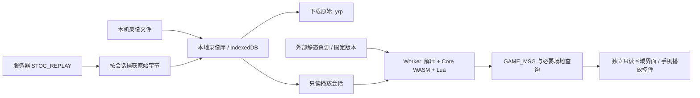

# 第二期：本地录像库、对局自动保存与标准录像播放

更新：2026-10-08。状态：**第二期首版已实现，R0–R3 的本地自动化验收通过，R4 真机与生产样本待验收**。用户确认第一期已可使用；本期“上传”已确认是选择本机文件导入浏览器，不上传云端。本文补充主设计 P4–P5；实际使用、构建与证据见 [录像说明](replay-usage.md)，不把源码核查或触屏模拟当作真机验收。用户后续已授权官网 HTML 配套，[录像接收](replay-import.md) 与官网按钮分别交付，不自动上传服务器。

## 1. 本期交付与边界

本期完整交付包含三个部分：本机 `.yrp` 导入／下载、服务器对局结束后的自动本地保存，以及这些录像在网页内播放。可靠存取和正确重放分别验收，最终不能用“只保存文件”代替完成播放。

| 能力 | 本期行为 |
| --- | --- |
| 导入 | 手机／电脑选文件；桌面可补拖入。识别实际文件头，保存原始字节，不能只判断扩展名 |
| 录像库 | 本地列表、搜索／分页、重命名显示标题、删除、大小与来源、保存／兼容性状态；不加载重放内核 |
| 下载 | 原始 `.yrp` 文件，可交回桌面 YGOPro；导入、缓存、导出 SHA-256 一致，不重新压缩录像 |
| 自动保存 | 捕获服务器实际发送的 `STOC_REPLAY`；每局独立保存，比赛按可确认的关联分组，退出后仍能打开 |
| 播放 | 优先支持本服务器对应的 YRP2／UNIFORM 联机录像；暂停／继续、单步、倍速、重新开始、跳到回合、切视角、退出、下载 |
| 手机 | 横竖屏可选文件和导出，播放控件至少 44px；卡片详情／历史／设置有触摸关闭入口 |

不新增云存储、账号录像同步或分享链接；不把录像上传到天梯主机。主机继续只生成、发送及保存它原本负责的录像，播放运算在玩家浏览器进行。桌面助手和现网裁定脚本本轮不改。

天梯官网原有公开录像下载仍可使用：下载文件后导入本地库即可。官网下载旁增加「网页版播放」是可行增强，标准播放器完成后可通过 HTTPS 公开下载代理，或由官网同源读取后向新页传递原件，进入同一本地库；它不需要新增云上传。小型公开卡组可用 hash 内容参数直接进入编辑器，文件与 deckbuffer 分别解析，后者须正确分开主／额外。实际接口、部署与手机限制见 [官网录像／卡组一键打开调研](website-replay-deck-handoff-research.md)。这些入口尚未实施，不作为核心本地导入／播放的前置条件。

网页内直接检索服务器录像库是另一项可选增强：现有接口仅提供 GET 列表／下载，当前公网网关只配置了 `/neos`，若接入需解决 HTTPS 路由并核查实际 CORS，不开放公共上传接口。本地宿主已有 CORS 响应，不能据此绕过 HTTPS 页读取 HTTP 的限制。参见 [公开录像插件](../../srvprotianti/plugins/public-replay-web/README.md)。

## 2. 调研事实与未验证项

| 核查对象 | 本轮结论 |
| --- | --- |
| 上游播放器代码 | [replay.ts](../src/api/ocgcore/replay.ts) 只解析 `.yrp3d` 消息记录；新标准播放器位于 `src/replay/` 与 `src/ui/Replay/`，经 `#/replays` 进入。SQLite WASM 与录像 Core 不同 |
| 原生录像接收 | [stream.ts](../src/infra/stream.ts) 已在动画队列之前用独立 framer 捕获 `0x17` 原件；[onSocketMessage.ts](../src/service/onSocketMessage.ts) 跳过该包，不打印完整录像 |
| 清理行为 | [resetUniverse](../src/stores/index.ts) 会重置 `replayStore`；持久库和待保存队列必须独立于对局 UI 清理 |
| 服务器尾包 | `CLIENT_send_replays()`、`DUEL_END` 和 `REPLAY` hook 可在 Match 末连续发送多局；大会模式可阻止给玩家录像。未下发不能宣称已保存 |
| 本地原生格式 | [replay.h](../../srvprotianti/ygopro/gframe/replay.h) 定义 32 字节基础头；本地 YRP2 扩展头为 80 字节，含 8 个 32 位 seed 和扩展字段；解码按版本分支，不给其他格式套同一偏移 |
| 压缩与规则 | 当前源码是 raw LZMA1／LZMA1EXT，props 和解压长度在头中；`REPLAY_UNIFORM=0x10`，Tag 和单人谜题另有标志。不是 ZIP、gzip 或视频文件 |
| 脚本初始化 | 本地 Core 的 interpreter 默认只加载 `constant.lua → utility.lua → procedure.lua`，没有自动加载 `special.lua` |

本地候选快照如下，**不代表已确认的正式服务器运行版本**。本轮已经编译 WASM，并用隔离原生实例生成和重演脱敏录像；没有读取生产私密配置或下载真实玩家录像。

| 输入 | 已核对的版本／规模 |
| --- | --- |
| 相邻 YGOPro 主体 | `5e63f18fb6b9a6ddc651bc2e8847eec9689ccbff` |
| 相邻 Core | `e04144d62499c17d0cfa8313f9742434ef99c3a7`；gitlink 源为 `mycard/ygopro-core`，该工作树无未提交改动 |
| 相邻基础 scripts | `5864b6f6e58d49738e0996b94e96655b51f420bf`；13,538 个 Lua，合计 31,832,371 字节，最大单文件 87,095 字节 |
| 本地 Lua | `ygopro/lua/src/lua.h` 为 5.4.8；本地项目按 C++ 编译 Lua。生产链接的版本和异常处理选项待核对 |
| 706 补丁 | GitHub 本轮读取的 master 为 `d6008e9832e5666e665a84dca2e8e59810b3cdfa`，与桌面设计快照相同；390 个 Lua，共 1,027,712 字节 |
| `special.lua` | 4,621 字节，SHA-256 `32b9580d09d7151d8123769fa826c21974c0d6d0b43e64f0088fc660e6efc356`；GitHub 固定版本与本地两种客户端的扩展副本一致 |
| 桌面 utility 底稿 | 官方 scripts `14745a5a3908861bba65d79cf9c542605c83d9cb`，66,473 字节；与相邻服务器 scripts 的 utility 68,547 字节不同，不能直接整份替换 |

706 来源：[固定补丁目录](https://github.com/301zrg/specials/tree/d6008e9832e5666e665a84dca2e8e59810b3cdfa/706)。桌面处理依据：[设计第 9 节](../../srvprotianti-desktop/DESIGN.md)、[scripts.rs](../../srvprotianti-desktop/src-tauri/src/scripts.rs)。Core/API 的上游定位参见 [Fluorohydride/ygopro-core](https://github.com/Fluorohydride/ygopro-core)，发布使用核对后的实际 fork 和 commit。

开工后的第一道门槛是取得非敏感环境指纹：生产使用的 Core／主程序、Lua／liblzma、最终 CDB 合并顺序与摘要、基础和覆盖脚本版本／摘要，以及授权测试产生的同格式录像。只收版本和测试文件，不要求生产账号、数据库密码或私有配置。能先在隔离本地服务器推进的工作不依赖协作者即时答复。

## 3. 推荐架构

已将上述候选 Core、Lua 和 raw LZMA 解码器编译为单线程 WASM，保留多 seed、`set_responseb`、完整 `query_*`、同步读卡／读脚本回调与有界错误输出；桥接见 `runtime/replay/core_bridge.cpp`。固定首播资源约 6.60 MiB，编译与内核回归通过，手机真机性能仍待测。[调用机制](https://emscripten.org/docs/porting/connecting_cpp_and_javascript/Interacting-with-code.html)、[文件打包](https://emscripten.org/docs/porting/files/packaging_files.html)。

已有 [n1xx1/ocgcore-wasm](https://github.com/n1xx1/ocgcore-wasm) 可参考绑定和构建方式，但它使用 EDOPro Core，示例是另一套 seed/API，异步版本还要求 JSPI。**本期不直接换成这个内核**；将它用于当前旧录像之前必须另证随机序列、规则、Lua 与消息 ABI 一致，不能因“同为 ocgcore”就认为兼容。

普通 Web Worker 内运行单线程 WASM，不启用 pthreads，不把 COOP／COEP、SharedArrayBuffer 或 JSPI 作为用户打开页面的要求。Emscripten pthreads 要求共享内存及跨源隔离；因此当前静态托管和 iframe 更适合先走单线程方案。[官方约束](https://emscripten.org/docs/porting/pthreads.html)。

在线首屏、组卡、录像列表和导入／导出都不下载 Core／Lua。点击支持格式的播放按钮后才加载；重复播放复用经校验的资源缓存。播放器不连接 WSS，也不借服务器运算。

## 4. 录像接收、落盘与退出时序

1. 主动入房创建独立 `sessionId` 和捕获上下文，连接另有递增 epoch，冻结安全的公开昵称、入房身份、HostInfo 与可验证资源版本；不保存完整登录串／带密码房名。重连有可靠恢复证据时保留比赛关联，否则分别记录，不能仅凭房名相同合并。
2. 完整帧解析后识别 `0x17`，立即复制 `packet.exData`，去掉两字节网络长度和协议字节。当前 YRP2 payload 应为“文件头 + 压缩体”，R0 必须与桌面保存文件逐字节核对；其他格式不凭经验重写。
3. 捕获和保存独立于慢动画与 UI 重置。任务携带原 session 和接收序号；后续换房、重新连接、切标签页不会拿新玩家状态覆盖旧录像。Blob／ArrayBuffer 和拆包仍保序。
4. 校验大小和基础头，计算 SHA-256，原字节与条目在 IndexedDB 同一事务写入；成功后才显示“已保存”。原始接收序号先固定，不能用异步 hash 完成顺序决定局号。
5. Match 的多份录像逐份保存。`CHANGE_SIDE` 只表示继续比赛；不能把 G1 胜负当作整场结束。协议没有可靠局号时按接收顺序显示“第 1 份／第 2 份”，局号字段为空，不能把中途加入收到的第一份必然写成 G1。
6. `DUEL_END` 后进入收尾状态，继续处理已排队消息和保存任务；不因首份录像到达就清理 socket。正常可等到流关闭并排空任务；主机不主动关闭时，未收到录像先等最多 10 秒，至少收到一份后才允许以 2 秒无新包结束等待，总等待最多 10 秒。已知实际完成局数时核对数量，不把 Match 固定猜成三局。这是初始参数，按真实尾包时序校准，不是“已收到全部局”的协议证明。
7. 保存任务为空且至少一份提交成功，显示实际已存数量。服务器禁止／未发送录像、流中断、尾帧不完整、超时和写入失败分别提示；不能只因收到 `DUEL_END` 就显示“录像已保存”。

收尾期间仍可看到结果；退出按钮明确显示正在接收录像，提供等待或立即退出。提前离开先保存已收到文件，对尚未收到的部分提示可能缺失。关闭浏览器／刷新不能依靠 `beforeunload` 完成异步写入，因此每份收到就存；恢复页面只列出实际提交成功的记录。

网络结束后再播放，避免终局尾包与回放 UI 争用状态；等待／对局／换备中不从同一标签页启动回放。各标签页的捕获队列独立，本地库可以共享。对局退出、重连和存储失败不得破坏正常联机。

观战只缓存服务器授权下发的标准录像。中途观战的可见消息流不伪装成全场 `.yrp`，也不从其他标签页的卡组或未公开数据补齐录像。

## 5. 本地库与文件行为

录像库使用独立、可迁移的 IndexedDB schema，并沿用 [storageKey](../src/variant/deployment.ts) 的项目／BiliToy 作品命名空间。表建议如下：

| 表 | 主要数据 |
| --- | --- |
| `replayBlobs` | hash、原始 Blob、字节数、实际格式；hash 唯一，原件不改 |
| `replayEntries` | 条目 ID、hash、显示标题、原文件名、导入／接收时间、来源、已知头信息、兼容性状态 |
| `replayOccurrences` | 条目与 session／接收序号／可确认局号的关联、安全对局信息、资源版本及来源置信度 |

同一会话重复下发同一内容去重；再次导入同一文件不复制 Blob，但更新来源关联。相同字节在不同比赛出现时保留比赛关联，不能只因 hash 相同丢掉一次比赛。删除事务检查引用后才删除 Blob；并发导入与跨标签页删除不能产生悬空条目。

列表默认新记录在前，手机用简洁卡片，按钮明确写“播放／下载／删除”；显示标题可修改，原文件名和原始字节仍保留。比赛有可信关联时展开单局，换备过程本身不在标准录像中，不编造换备操作回放。损坏／不支持播放的条目给出原因，已保存原件仍可下载。

使用文件头识别 YRP1／YRP2；`.yrp3d` 保留旧消息格式的存取能力，播放仅在对应 fixture 和字段校验通过后开放，不冒充标准录像。伪装扩展名、截断头和异常长度不自动入库；未知来源／未知版本不能自动标“706 已验证”。

初始单文件导入上限 8 MiB，本地库软预算 100 MiB；上线前可根据样本和手机调整。达到软预算或真实配额不足时停止新增落盘，提供已接收文件的即时下载和清理入口，不静默删除旧录像；用户主动删除才释放记录。不用 localStorage 保存二进制或 Base64。

落盘失败时保留有界的当次内存副本，显示“仅本次页面可用”，可播放／下载；退出前提示未保存。浏览器存储可能被回收，持久存储请求也可能不获准，应提供容量显示、导出和明确的失败反馈。[存储配额](https://developer.mozilla.org/en-US/docs/Web/API/Storage_API/Storage_quotas_and_eviction_criteria)、[persist](https://developer.mozilla.org/en-US/docs/Web/API/StorageManager/persist)。

同域名同作品更新复用库，迁移只改 schema；更换站点、浏览器或 App WebView 不自动迁移，用 `.yrp` 导出／导入。可重新下载的资源缓存与用户录像库分开，“清理播放资源”不得删除卡组或录像。

下载通过用户点击生成 Blob URL；文件名去除路径／控制字符，不拼账号密码；完成后释放 URL。Android／iOS／BiliToy 内嵌页分别验收文件选择、下载与系统分享；支持时可用 `navigator.canShare({files})` 提供另存／分享回退，不强依赖文件系统选择器。[Web Share](https://developer.mozilla.org/en-US/docs/Web/API/Web_Share_API)。

原始 `.yrp` 没有本项目的完整 Core／脚本摘要，单独导出后再导入不能从文件名恢复可靠环境身份。本地关联元数据只表示已知来源，不作为执行任意远程脚本的授权。

## 6. 标准播放与状态隔离

解析器按实际头、版本和 flags 分支，校验压缩参数、解压尺寸、姓名／牌组长度、单条 response 长度及剩余字节。首要播放范围是已验证的本服务器 YRP2／UNIFORM 普通联机 Single 和 Match 各局；Match 是多份独立录像，不是一个文件里自动还原整个比赛。

YRP1 除头长外还涉及旧随机行为，本地 `ReplayMode::StartDuel()` 会先用 `std::mt19937(seed)` 取一次结果再创建单 seed Core；不能与 YRP2 共用多 seed 初始化。Tag 和单人谜题要单独处理，不能把 `REPLAY_SINGLE_MODE` 的单人谜题当作普通 Single 房。首轮未通过对应样本时仅保存／下载，不显示可用播放按钮。双打完整重放依赖四人队友轮换、牌组顺序和 Tag UI 的专项适配，不用双打等待页已支持作为播放证据。

Worker 先验证并加载固定资源，注册同步 CardReader／ScriptReader，再创建 duel，按原始顺序装入 main／extra、设置录像中的 LP／手牌／抽卡／规则 flags、启动并回灌原响应。不能按当前禁表筛掉历史牌组、重新洗牌，或强行改成 MR2；不自动向网络请求缺失卡和最新版 Lua。

初始建议由已锁定 CDB 在构建时生成精确的 Core 卡数据表，Worker 同步按 ID 查询；其生成源 SHA 写进资源 manifest。以核对后的服务器有效 datas 为依据：与当前 1103 基线一致时复用，不一致时列出规则字段差异并建立兼容 profile，不能拿现代数据库静默替代。保留 alias、type、setcode、Token 及跨卡依赖，64 位整数不能经过 JS Number 舍入。卡文和语言可以切换，但不能改变播放时固定的规则数据。

实际首版先从头信息建立姓名与规则，每个可显示步骤直接查询 Core 的 LP、回合、阶段、当前玩家及双方所有区域，关闭 query 缓存，读取实时 ATK/DEF、素材和指示物。`messages.ts` 按该原生版本的消息长度拆分 GAME_MSG，宣言卡另行跟踪。不能只把 `get_message()` 顺序喂给 UI，否则会缺这些状态。

实现选择独立 `ReplayEngine`／Worker 和只读区域界面，而不复用仍引用在线全局 store 的 service／决斗组件，避免播放意外触发时间确认、选卡响应、准备、聊天、弃权或重连。复用四语卡片 API、卡图与详情数据，原生选择由录像 response 驱动。进入录像页关闭该标签页原有连接，离开播放终止 Worker，不重置保存队列、组卡或联机草稿。以后若统一场地外观，应先把共享展示组件与在线响应拆开，保留本轮隔离回归。

倍速只是提高显示推进速度，不改变 Core 决策。单步按有效状态事件推进；跳到回合通过确定性重演和有界快进实现，显示进度并可取消。没有状态快照时不承诺任意进度条瞬时跳转；重新开始和跳回需销毁旧 duel、从同一 seed／资源重建。暂停停止请求后续批次，切后台自动暂停。

正常终局检查状态、响应消费和关键事件，不能仅以出现 MSG_WIN 标正确。弃权／超时／异常终止的标准文件可能在响应耗尽时仍处于等待选择；先核对桌面行为，必要时显示“记录到此结束”，不能伪造后续流程或把外部结果冒充 Core 重演结果。

## 7. special.lua：需要做的兼容处理

**需要处理的是新增的浏览器本地重放初始化。** 当前在线网页不执行卡片 Lua，由服务器裁定；前端加文件不会改变在线规则。

已核查的 `special.lua` 定义 `Auxiliary.PreloadUds()`，修改 Card 的之前位置／表示判断、`Duel.NegateSummon` 和 `Card.RegisterEffect`，记录反转效果并提供 `Card.GetFlipEffect`，还定义旧裁定辅助条件。与光道武僧踢走反转怪、反转召唤被神警等无效后的送墓／苏生限制、离场去向有关，不只是卡名描述或某一张卡的覆盖脚本。

桌面原版 YGOPro 的方式是在 `utility.lua` 的 Auxiliary 初始化之后嵌入 special 定义并调用 `Auxiliary.PreloadUds()`；KoishiPro 有自己的加载路径。相邻 Core 默认没有这一调用，单独把 special 放到脚本目录不会生效。

推荐浏览器资源构建遵循以下过程：

1. 锁定实际兼容的完整基础脚本、706 覆盖树、Core、Lua、CDB；按生产有效优先级合并。相邻服务器源码优先 `specials/`，其次 `expansions/script/`，最后基础脚本，不能只复制 390 个补丁就声称完整。
2. 以该 profile 的基础 `utility.lua` 为底稿，生成浏览器专用副本：在 Auxiliary 已创建、Card／Duel API 和 constant 已就绪、任何卡片注册效果之前，加入 special 定义并调用一次 `PreloadUds()`。保留底稿、补丁及生成件各自摘要；不改原文件。
3. 先检查基础 utility／生产覆盖是否已经处理 special，若已初始化不再注入；若 utility 有结构性变化、后续重定义会覆盖补丁、所需 API 不存在，则停止生成并定位，不用模糊字符串插入。
4. 每个新 duel 使用新的 Lua 状态；重播／跳回通过销毁重建，避免同一状态重复安装 hook 或残留上一局的反转效果列表。
5. 启动诊断确认缺失脚本会报错，并验证 hook 与所需 API 就绪；完整行为用录像 fixture 比较，不能以函数“存在”替代旧裁定生效。

不要先创建 duel，再单纯 `preload_script('special.lua')` 就算完成：它只定义函数，且某些 Card 效果可能已注册。若改用独立 bootstrap，必须证明与生成 utility 方式有相同的初始化时机；不能被后续 `Auxiliary={}` 清掉，也不能安装两次。

必须包含正、反例：光道武僧与反转怪；反转召唤被神之警告等无效；涉及先前位置／完成苏生限制的处理；离场去向重定向及全场除外效果的边界；普通召唤／通常送墓不被误改。同一录像在“正确补丁”和“缺补丁”条件下应至少有一个可区分结果，才是有效回归。

## 8. 资源版本、托管与运行限额

播放资源 revision 与现有 `1103-201103-v1` 显示资源分开，manifest 锁定 Core fork／commit、Lua／liblzma 版本、工具链和异常处理选项、基础／706 commit、生成 bootstrap、Core 卡表和各文件 hash。录像关联固定一版，播放中不自动升级。录像头 version、联网协议版本和 Core commit 是不同信息，不能互相替代。导入文件只提供版本线索；相同录像头不能证明来自某个脚本 SHA，来源未知须明确显示。

保留完整有效 Lua 依赖树：公共脚本、`Duel.LoadScript`、跨卡引用及生成 Token 等都可能越出组卡 ID。初期不按 5267 个卡号随意裁剪。基础 Lua 约 30.36 MiB 的未压缩量不宜整份明文网络下载，建议外部静态站发布压缩 `.data` 包和索引，必要时按 manifest 分块；Worker 一次装入经校验的紧凑字节表，同步取脚本，不把全部 Lua 额外复制为 UTF-16 字符串。

普通版保留合适的 WASM MIME；加载器可在 MIME 不支持流式编译时回退有界 ArrayBuffer 实例化，但不能吞掉 404、HTML 响应或 hash 错误。BiliToy 使用已适配的相对路径、`.wasm/.data/.js/.json` 文件和作品存储键，Lua 只在固定数据包内，不上传 `.lua` 散文件；iframe 的 Worker、WASM、缓存及下载仍需平台真机验收。资源仍放主机之外。

Cloudflare Pages 单文件限制当前是 25 MiB，因此按压缩后的实物大小验收并分包；首播新增传输量暂以 12 MiB 为目标，实物包体和首播耗时在 R0 后填写，不把源文件量当作压缩下载量。[平台限制](https://developers.cloudflare.com/pages/platform/limits/)。

| 限额 | 初始方案与依据 |
| --- | --- |
| 导入原文件 | 8 MiB；读取前检查 size，拒绝无限分配 |
| 当前 profile 解压正文 | 512 KiB，对齐本地 `MAX_REPLAY_SIZE=0x80000`；其他 profile 必须单独论证，不由任意文件头放大 |
| LZMA 字典 | 最高 32 MiB；本地 writer 使用 16 MiB；在分配前检查 props |
| 脚本包解压 | 64 MiB 及 manifest 精确长度，覆盖已测约 32.9 MB 的基础与补丁输入 |
| 待保存队列 | 2 MiB 原始 payload；有界降级，不阻塞联机或无限囤积 |
| Worker 输出 | 每批至多 128 消息／256 KiB，在途至多 1 MiB；消费者确认后才继续 |
| 活跃计算 | 初始 120 秒总预算／100 万次 process；单次无进展 10 秒由主线程 watchdog 中止，排除暂停和正常等待时间 |
| Worker WASM 内存 | 初始硬上限 256 MiB；结合手机实测收紧，退出后检查释放，不保证此为整页总内存 |

这些值是施工初始限制，调整要有真实长对局／手机数据。全量预演再一次交给 UI 不作为默认实现。损坏 response、未知 opcode、缺少卡数据／Lua、持续 MSG_RETRY、Lua 错误与超时应结束本次播放，保留原件和可理解错误。

停止／退出应先尝试释放 duel，并有强制 `worker.terminate()`；后者可立即结束卡住的 Worker，由主线程提供取消入口。释放 Blob URL、计时器、消息队列和临时状态；不能等待失控 Lua 自行返回。[Worker 终止](https://developer.mozilla.org/en-US/docs/Web/API/Worker/terminate)。上传文件不携带可执行 Lua／JS；ScriptReader 只取固定 manifest 中的路径，不接受任意路径和 URL。

资源缓存可重建；用户录像需要导出备份。本期验证已加载页面在资源缓存齐备后不依赖 WSS 播放；全站离线冷启动和 PWA 安装留作独立增强。

## 9. 施工顺序与验收门槛

2026-10-08 用户已授权施工。R0 历史内核、R1 本地库、R2 网络捕获和 R3 播放已实现；验收用原生脱敏样本及隔离 WSS。下表保留完整门槛，未有设备或生产证据的项仍待测，不宣称整张矩阵已完成。

| 阶段 | 工作 | 完成门槛 |
| --- | --- | --- |
| R0 兼容切片 | 核对指纹；隔离生成授权录像；构建匹配 Core／Lua／LZMA WASM 与脚本 bootstrap；最小只读重演 | 原始 payload／桌面文件一致；随机起手、连锁与关键 706 裁定逐步匹配。失败列具体差异，再调整 runtime，不换现代内核蒙混 |
| R1 本地库 | IDB schema、导入／列表／下载／删除、事务去重、配额与并发、移动文件入口 | 原字节往返一致；刷新／迁移／跨标签页和写入失败正确；存取不加载 Core |
| R2 对局捕获 | `0x17`、独立 session／保存队列、Match 尾包、结果页实际保存状态 | Single 和普通 Match／TT G1–G3 逐局保存；0 份／重复／连续多份／半包／关闭／提前退出均区分；不影响一期入房与换备 |
| R3 完整播放 | Worker 流控、查询同步、只读 Context、手机控件、缓存、暂停／单步／倍速／跳回合 | 桌面结果与多检查点一致；双方视角正确；暂停／后台／取消／重复打开／异常文件有界；无 WSS 或 CTOS 副作用 |
| R4 发布 | 普通／子路径／BiliToy 包、许可与对应源码、真机、回退 | 已验证格式明确；桌面与 Android／iOS 真机导入→播放→下载完成；首页与联机没有新增 Core／Lua 请求 |

建议提交分别为 runtime 锁与兼容样本、本地库、在线捕获、播放器与手机 UI、部署资源。服务端只有真实证据表明尾包／格式契约有问题时才单独修补；不因添加前端播放就默认改 Nginx 或重启主机。保留一期构建可回退；回退 UI 不删除本地录像库。

## 10. 必测样本及本轮交付说明

| 类别 | 最低样本 |
| --- | --- |
| 正常对局 | 普通 Single，普通 Match，TT G1–G3／换备后牌组，先后手交换，长对局 |
| 随机与状态 | 洗牌／抽卡、随机结果、连锁、攻击／伤害、素材、指示物、实时攻守、宣言卡名 |
| 旧裁定 | 第 7 节 special 正反例及多次重新开始／跳回；与匹配的原版／KoishiPro参考环境比较 |
| 收尾 | 重复录像、三份同一 WS 消息、多帧拆分、DUEL_END 前后到达、禁止下发、掉线、手动退出、写入期间刷新 |
| 存储 | 相同文件反复导入、不同比赛关联、IDB 禁用／配额不足、跨标签页、升级／回退、清资源保留录像 |
| 错误 | 错 magic、截断、异常 flags／header_version、恶意 datasize／LZMA 字典、response 越界、缺依赖、未知卡／opcode、计算超时 |
| 隔离 | 播放不能发送准备／时间确认／选择／弃权；退出不覆盖原昵称／卡组／换备缓存，不混淆双方姓名与视角 |
| 托管／手机 | 根路径与子目录，首次／重复资源加载，错误 MIME／404／坏 hash；Android Chrome、iOS Safari及实际采用的 iframe 平台 |

测试用隔离服务器和明确允许发布的脱敏录像；真实玩家原始录像含牌组，不直接提交公开仓库。保留头信息、资源 manifest 和生成来源；正常文件至少比较初始牌组／起手、回合阶段、关键事件、LP、实时属性、赢家及 response 消费，不能只对最终画面做截图。

前期已完成源码和公开资料调研，核对桌面 special 处理、远端补丁 SHA 与本地副本、基础脚本规模及候选版本，并形成上述范围、结构、限额和验收计划。2026-10-08 用户已授权本轮自动部署验收后开工，不再等待第二次开工确认。

施工准备记录：已建立 `codex/replay-phase2` 独立工作分支，并合入已成功自动发布的 `17aa0c25` 构建修复；尚未向发布分支合入录像功能。Cloudflare 真实构建成功，线上提交号匹配；25 个 JS／CSS、四语卡库／strings／禁表 SHA、桌面与手机尺寸首页／组卡／卡组参数导入、浏览器 WSS 正常握手均通过，没有发送玩家登录或对局请求。自动部署门槛已满足，进入录像 R0。

复核本地候选 Core／基础脚本仍为第 2 节所列提交，原始响应上限需以实际 Core 的 `SIZE_RETURN_VALUE=256` 和文件单字节长度为准，不套旧实现常见的 64 字节假设；CardReader 还包含规则 alias 转换与额外系列码，应连同 datas 一起复制其有效语义。当前 Docker daemon 未运行，WSL 枚举不可用；已在项目忽略目录安装官方 Emscripten 4.0.23（emsdk 提交 `c0bb220cb6e6f4e0fabb6f6db9efd53390ef5e56`），后续生成固定 WASM 资源和可复现构建说明。

施工结果：已生成固定 WASM、5267 张 Core 卡表和 13542 份完整 Lua，复用核对过的现有 special bootstrap，仅调用一次。三份原生 fixture 共 483 个检查点、738 条响应匹配，重新开始全帧摘要相同；武僧样本移除反转效果 hook 后产生可区分差异。存储事务、失败回滚、旧会话隔离和触屏尺寸播放器通过；真实本地 Single 与 TT G1–G3 的原始尾包逐字节入库，并验证换备与首次重新入房。实际 Core 对象的素材与指示物完整查询及本地 BiliToy 相对路径 iframe 播放也已通过。神警部分目前是实际 Card／Effect 与受控参数边界测试，完整原生神警对局、更多特殊状态、正式服授权样本、Android／iOS 真机和平台实际 iframe 仍须补验。[详细证据与命令](replay-usage.md)。
