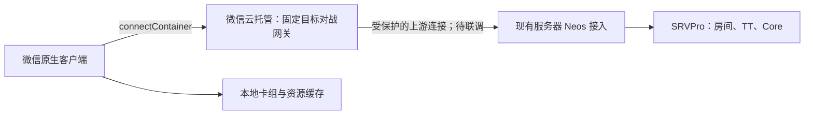

# 微信原生客户端可行性调研

调研日期：2026-10-07。范围：现有 1103／2011.3 天梯的组卡、普通房、TT Match 和手机操作。本次只调研与形成建议，未注册账号、购买云资源、提交审核或实现微信客户端；以下技术链路尚未做微信真机验证。

## 结论

技术上可以做。现有 SRVPro 继续负责裁定、Lua、匹配和结算，微信端负责组卡、显示和响应操作，不必重新开发决斗引擎。建议复用经过验证的协议与资源生成逻辑，重写界面及微信平台适配。

微信能负责客户端代码的分发，但不会自动替我们代理到天梯服务器。本地卡组也不是微信独有能力：现网页版已经用 IndexedDB 保存。更换静态站域名时，各域名的卡组存储互相独立，需通过 YDK 导出／导入迁移。

**如果目标是完全免备案，微信不符合条件。** 如果可以接受小程序／小游戏备案，但目前无法办理自有域名备案，可以重点验证微信云托管接入：官方支持免配置通讯域名的 WebSocket 调用。它提供了另一种入口，尚不能证明现有游戏一定能通过发布审核。

## 发布要求必须先确认

### 客户端备案与服务器域名备案是不同事项

| 事项 | 当前结论 |
| --- | --- |
| 普通 `wx.connectSocket` 接入 | 需在后台配置合法服务器域名，使用可信 WSS；官方要求该域名完成 ICP 备案，公网 IP 不能替代合法域名 |
| 微信云托管接入 | `wx.cloud.connectContainer` 可连接托管的 WebSocket 服务，无需自行配置通讯域名；不等于免除客户端备案和游戏内容审核 |
| 小程序／小游戏正式发布 | 须履行相应备案及审核；开发者工具关闭域名校验只能用于调试 |

依据：[微信联网规则](https://developers.weixin.qq.com/miniprogram/dev/framework/ability/network.html)、[云托管 WebSocket](https://developers.weixin.qq.com/miniprogram/dev/wxcloudservice/wxcloudrun/src/development/websocket/miniprogram.html)、[小游戏发布流程](https://developers.weixin.qq.com/minigame/introduction/guide/index)、[工信部 APP 备案通知](https://www.gov.cn/zhengce/zhengceku/202308/content_6897341.htm)。

因此，当前未备案的 `duel.ygomatch.xyz` 和不断变化的 Quick Tunnel 地址不能直接作为微信正式版本的接入方案。把客户端重写为原生，也不会让该域名满足备案要求。

### 应按真实功能申报游戏

仅查卡、组卡、保存和导出，可以作为独立工具产品评估。加入实际联机对战后，应按游戏功能评估小游戏路径，不能以工具类目隐藏对战。普通小程序和小游戏的运行结构也不同；不要假定先发布一个 WXML 工具 AppID，随后便能直接增加完整对战。

特别需要向微信确认：**YGOPro 这种 TCG 对战应归到哪一个二级／三级类目？** 官方当前不向个人主体开放文化互动、角色类和牌类；但不能仅凭“使用卡片”就断言本项目必定属于平台的牌类。

若被归为牌类，现有产品要求会遇到实质冲突：运营规范 2.5.6 对自定义昵称、自由房间聊天、房间密码等设有限制。自填昵称、原样房间命令、TT 身份是本项目既有要求，在得到类目与功能审核结论前，不自动删改这些要求。

依据：[类目设置](https://developers.weixin.qq.com/minigame/introduction/guide/type.html)、[平台运营规范](https://developers.weixin.qq.com/miniprogram/product/)的小游戏特别规范。

### 不能把所有游戏都写成“必须先有版号”

官方目前分两条路径：开通虚拟支付的 IAP 要求出版物号核发单、软件著作权登记等材料；不开通虚拟支付的路径有小游戏前置备案和后续小程序备案。后者的资质页面要求部分情况提供软著或授权，例如英文名称、品牌合作。

本项目完全免费、无广告的具体申报方式、TCG 类目及资源授权仍须平台确认；不能把 IAA 指引自动当作该游戏已获免版号认可。也不能用多年以前的博客清单替代当前官方规则。

依据：[IAP 资质](https://developers.weixin.qq.com/minigame/introduction/guide/zzsh-iap.html)、[不开通虚拟支付的资质流程](https://developers.weixin.qq.com/minigame/introduction/guide/zzsh-iaa.html)、[小游戏前置备案](https://developers.weixin.qq.com/minigame/introduction/guide/nrjs.html)、[小程序备案](https://developers.weixin.qq.com/minigame/introduction/guide/xcxba.html)。

本仓库保留 GPLv3 许可证。复用 Neos 代码要保留相应开源义务；这份代码许可本身不证明游戏王卡图、文本、商标等资源获准在微信公开运营。发布前需单独确认资源权利和可提交的授权材料。平台规范明确约束这类资源：[知识产权及内容规范](https://developers.weixin.qq.com/miniprogram/product/)。

## 可复用与需要重写的部分

| 模块 | 建议 |
| --- | --- |
| SRVPro、OCGCore、Lua、TT 计分 | 保留服务端实现；微信端不运行在线裁定引擎 |
| 原生 YGOPro 封包、拆包、CTOS／STOC 适配 | 优先抽取复用；微信 SocketTask 支持 ArrayBuffer，协议无需因微信改成 JSON |
| 房间和决斗状态 | 复用逻辑与测试样本，解除对浏览器对象和界面 store 的依赖；保持消息串行处理 |
| React、DOM、网页组件和 CSS | 重写。普通工具可使用 WXML／WXSS；完整小游戏通常使用 Canvas／WebGL 与游戏 UI |
| WebSocket、ReadableStream、window 定时器 | 改为微信传输适配和独立消息队列；不能直接复制现有连接类 |
| IndexedDB、浏览器文件选择与下载 | 改为微信存储、文件或文本导入／导出；需真机验证聊天文件与剪贴板操作 |
| 四语 CDB、strings、禁表 | 复用现有来源和生成检查；微信发布资源另外生成 |
| 音频、横竖屏、键盘、详情弹层 | 使用微信能力重做交互，尤其是手机横屏的软键盘和长文本 |
| 标准录像播放、完整双打 | 单独阶段；现网页版未完整验收的能力，不因迁移而变成已支持 |

本地依据：[封包与重组](../src/api/ocgcore/ocgAdapter/packet.ts)、[浏览器连接类](../src/infra/stream.ts)、[本地卡组](../src/stores/deckStore.ts)、[SQLite 加载](../src/middleware/sqlite/index.ts)、[现有设计](../YGOPro_706_Web_Client_Design.md)。平台依据：[SocketTask 二进制发送](https://developers.weixin.qq.com/miniprogram/dev/api/network/websocket/SocketTask.send.html)、[小游戏项目与 Canvas 结构](https://developers.weixin.qq.com/minigame/dev/guide/develop/start.html)。

## 原生客户端的建议结构

这是一项新客户端工程，建议独立目录或仓库，同时维护共用的协议包、资源构建与规则测试，避免两套代码分别修复同一种协议问题。

```text
共享层：YDK／卡池校验、禁表、协议编解码、房间和决斗状态
平台层：SocketTask／云托管连接、本地存储、资源加载、生命周期
界面层：微信原生渲染的组卡、房间、决斗、设置和操作提示
服务端：沿用现有 SRVPro，另验证接入网关
```

完整对战建议先比较纯 TypeScript＋Canvas 2D 与成熟小游戏引擎。前者依赖较少，但文字排版、滚动列表、输入、命中检测都要自行处理；引擎能减少这些工作，代价是包体与工具链。本次不强行决定引擎，先用小原型比较组卡和决斗提示的真机表现。现有 React 页面不是可直接上传的小游戏代码包。

### 卡池与本地卡组

建议在开发机把现有 CDB 转换成共享卡片元数据、分语言文本和搜索索引，微信端不必首先移植 `sql.js`／SQLite WASM。保留 5,267 个卡号基线、alias、类型、可组卡边界及禁表身份；64 位字段用无损格式，避免 JSON 数字转换导致精度损失。先加载当前语言，其他语言按需加载并原子切换。

卡组继续保存 `main / extra / side` 的卡号数组、名称、版本和稳定 ID，语言切换不改变牌组。微信 `wx.setStorage` 当前单 key 上限 1 MB、总量 10 MB，足以容纳数量较多的纯卡号牌组；每副单独保存，另设小型索引，不把全部卡组放在一个 key。容量由实际序列化字节数控制。

本地保存应处理写入失败、版本升级和清理后的恢复提示，并提供 YDK／文本备份。微信本地存储也可能因用户清理或存储压力丢失，不自动跨设备同步；云备份是另一个功能。卡图和卡库不能占用全部卡组存储，另设有上限的资源缓存。

依据：[微信本地存储](https://developers.weixin.qq.com/miniprogram/dev/api/storage/wx.setStorage.html)。现网页已经有本地保存，若问题只是换镜像后找不到卡组，固定域名加导入／导出也能处理，无需为此重写客户端。

## 大陆联网的两条路线

### 路线 A：合法域名直连现有 Neos WSS

```text
微信客户端 → 已备案域名／可信 WSS → Nginx → SRVPro Neos
```

结构简单、无须增加转发云服务，但不满足今年不能办理自有域名备案的现状。微信的 TCP API 也有合法域名／局域网限制，不能把任意公网 `121.4.34.71:7911` 当作正式微信客户端的绕过方案。[微信联网规则](https://developers.weixin.qq.com/miniprogram/dev/framework/ability/network.html)

### 路线 B：微信云托管提供受控入口



这是针对当前条件更值得验证的技术候选。托管一个轻量固定目标网关，客户端使用平台通讯能力，网关连接既有天梯；不在主机上部署前端，也不向玩家开放目标 IP／端口。主服务器的对战算力消耗仍存在。

**这张图是设计推断，不是已验证方案。** 最少需要验证：

1. 选定小游戏 AppID、基础库和 Android／iOS 是否都能使用 `connectContainer`，包括二进制消息。
2. 网关到主服务器的路由、加密和鉴权；避免沿用 Cloudflare 隧道作为唯一上游，否则并未消除这项依赖。
3. 保留用户真实 IP，不能让所有玩家在服务器看来都来自网关。当前 SRVPro 的连接限制、部分身份和重连判断依赖 IP。云托管文档提供 `X-Original-Forwarded-For`，需验证 WebSocket 握手中是否可用，并仅信任受控网关。
4. 当前本地 7978 网关专门为 Cloudflare 设置了 Origin 和来源头检查，不能直接拿来接收微信云托管；应单独设计入口，禁止简单开放任意 Origin 或任意转发目标。
5. 服务发布、扩缩容、连接时限和空闲断开对整场 Match 的影响。短请求云函数不能直接替代持续 WebSocket 网关。

参考：[云托管 WebSocket](https://developers.weixin.qq.com/miniprogram/dev/wxcloudservice/wxcloudrun/src/development/websocket/miniprogram.html)、[受控来源信息](https://developers.weixin.qq.com/miniprogram/dev/wxcloudservice/wxcloudrun/src/development/weixin/)、[当前 Cloudflare 专用网关](../deployment/windows/neos-tunnel.conf)。官方还指出 iOS 高性能+ 模式下该接口暂不能携带 OpenID，不能把 OpenID 头存在作为所有平台必然成立的登录前提。

微信身份不自动替换 TT 身份：仍使用用户输入的天梯昵称／密码及房间命令。若平台允许这些功能，`TT` 进入匹配，其他房名保持服务器原义；密码只留在会话内存，退出一场保留会话输入，不写入公开配置或日志。需要跨平台账号绑定时再单独设计。

### 网关成本

云托管按资源计费，不是永久免费。官方当前示例的 0.25 核／0.5 GB 实例为 0.02975 元／小时；若连续运行 30 天，计算资源约 **21.42 元**，不含流量、资源存储、构建等费用。这是价格计算，尚未证明此规格能承受预期人数。

若为服务器防火墙和可信代理配置购买固定出口 IP，官方当前另收 **49 元／月／环境**。也可另评估受控隧道或私网连接；本次没有购买或确认可用路线。首环境试用额度有有效期，不把试用额度当长期成本。参考：[云托管定价](https://developers.weixin.qq.com/miniprogram/dev/wxcloudservice/wxcloudrun/src/Billing/price.html)。

## 手机端仍须专项设计

原生端能改善触控一致性，但不会自动让 YGOPro 的复杂选择变得好用。建议明确设计：点击加减卡、长按详情、可关闭抽屉、显眼的手动准备、退出确认、足够大的决斗按钮、场地区域选择和长效果阅读。卡名检索支持系统键盘，不能依赖鼠标右键、hover 或 Esc。

来消息、切聊天、锁屏和 Wi-Fi／蜂窝切换必须视为可能中断：监听生命周期和网络状态，保留原始入场身份、G1 卡组封包及房间快照。恢复应按服务器协议进行，不自动换房，不重发过期 RESPONSE。桌面开发者工具成功不能证明移动端后台连接能持续；官方也要求以真机表现为准。[运行环境说明](https://developers.weixin.qq.com/minigame/dev/guide/runtime/env.html)

## 推荐推进顺序

1. **先确认发布前提。** 提供真实玩法截图／说明，向平台确认 TCG 类目、可用主体、不付费不投广告的申报路径、资源授权以及昵称／房间／聊天要求。不要先注册成一个不适合的类目，也不要把资源换成占位图后得到的技术测试误当作实际内容可发布。
2. **验证最小微信原型。** 测试本地保存、检索、输入、横竖屏与云托管二进制回环；然后连接隔离 SRVPro，确认 HostInfo、手动准备、开局及一次有效操作。
3. **证明整场可用。** 普通房、TT G1–G3、两次换备、取消／退出、错误密码、两名用户 IP 区分、断线恢复和长时连接，使用授权测试账号与卡组。
4. **再完成原生 UI 与发布。** 共用协议和资源检查，完成真机与内容审核要求；标准录像、全双打、云卡组另立验收。

今年以最少投入让玩家先用，继续完善外部静态网页更直接。长期想获得微信分发和专门的手机体验，可以推进原生客户端，但应先解决类目／授权和云托管最小链路。只有这两部分得到肯定结果，才值得投入完整界面重写。
